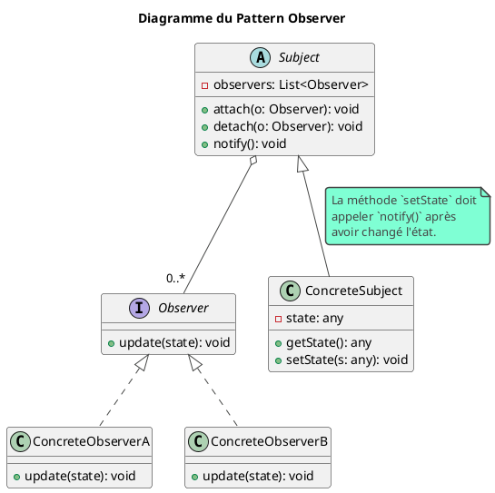
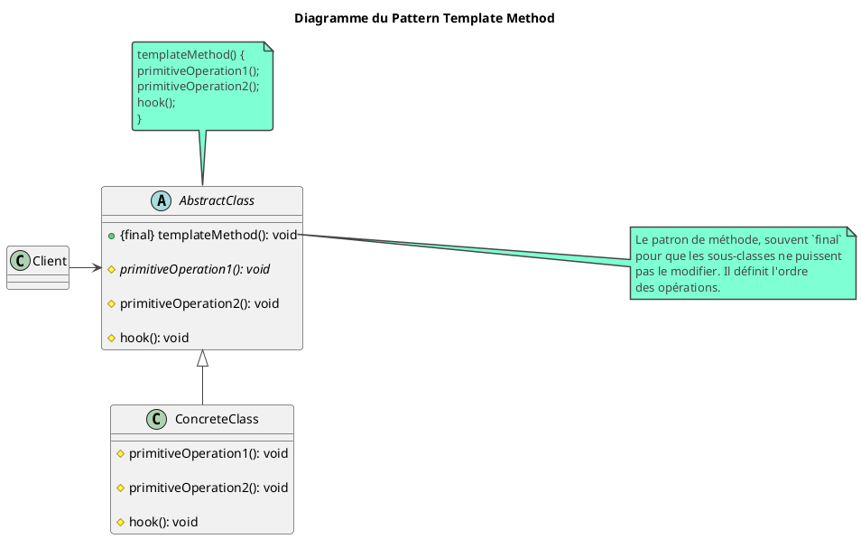

# Les Patterns Comportementaux : L'Art de la Communication entre Objets

## Objectifs Pédagogiques

À la fin de ce module, vous serez capable de :

* **Comprendre** comment les patterns comportementaux gèrent les responsabilités et les interactions entre les objets.
* **Implémenter** en Java les patterns Strategy, Observer et Template Method.
* **Utiliser** le pattern Strategy pour rendre des algorithmes interchangeables.
* **Mettre en place** un système de notification flexible avec le pattern Observer.
* **Définir** un squelette d'algorithme avec le Template Method tout en laissant les sous-classes le compléter.
* **Identifier** ces patterns dans les frameworks que vous utilisez au quotidien, comme Spring.

## Introduction : Les Règles du Jeu

Nous avons nos briques (Patterns de Création) et nous avons assemblé les murs de notre maison (Patterns de Structure).
Maintenant, il faut définir les règles de vie à l'intérieur. Qui a le droit de parler à qui ? Comment une décision
est-elle prise ? Comment une information est-elle diffusée ?

Si nous ne faisons pas attention, les interactions entre les objets peuvent vite devenir un "plat de spaghettis" : un
enchevêtrement de dépendances où un changement dans une classe en impacte dix autres.

Les **Patterns Comportementaux** sont là pour ça. Ils se concentrent sur les **algorithmes et l'assignation des
responsabilités entre les objets**. Ils nous fournissent des schémas de communication élégants pour que nos objets
collaborent de manière souple et découplée. Ils sont la clé pour passer d'un programme statique à une application
dynamique et réactive.

## L'essentiel : Les Canaux de Communication

### Le Pattern Strategy (La Stratégie)

#### L'intention

**Définir une famille d'algorithmes, encapsuler chacun d'eux, et les rendre interchangeables.** Le pattern Strategy
permet à l'algorithme de varier indépendamment des clients qui l'utilisent.

Imaginez que vous utilisez une application GPS. Vous voulez aller d'un point A à un point B. L'application (le
`Context`) vous permet de choisir votre **stratégie** de calcul d'itinéraire : le plus rapide, le plus court, celui qui
évite les péages, ou le plus écologique. Chaque option est un algorithme différent, mais pour vous, l'utilisateur,
l'interface reste la même : "calculer l'itinéraire".

#### Structure et Implémentation

##### Diagramme UML

<code-block lang="plantuml">
@startuml
!theme vibrant
title "Diagramme du Pattern Strategy"

class Context {

- strategy: Strategy

+ setStrategy(s: Strategy)
+ executeStrategy(): void
  }
  note right: Le Contexte utilise une stratégie\nmais ne connaît pas son implémentation.

interface Strategy {

+ execute(data): void
  }

class ConcreteStrategyA implements Strategy {

+ execute(data): void
  }

class ConcreteStrategyB implements Strategy {

+ execute(data): void
  }

Context o--> Strategy : utilise
Client -> Context
Client -> ConcreteStrategyA : choisit
Client -> ConcreteStrategyB : choisit
@enduml
</code-block>

##### Exemple : Stratégies de paiement

Pour notre bibliothèque, un utilisateur pourrait avoir à payer une amende. Il pourrait vouloir payer par carte de crédit
ou par PayPal.

1. **L'interface de stratégie (Strategy)**

```java
package fr.formation.spring.app.strategy;

// L'interface commune pour tous les algorithmes de paiement.
public interface PaymentStrategy {
    void pay(double amount);
}
```

2. **Les stratégies concrètes (ConcreteStrategy)**

```java
package fr.formation.spring.app.strategy;

public class CreditCardStrategy implements PaymentStrategy {
    private String cardNumber;

    public CreditCardStrategy(String cardNumber) {
        this.cardNumber = cardNumber;
    }

    @Override
    public void pay(double amount) {
        System.out.println("Paiement de " + amount + "€ par Carte de Crédit "
                + cardNumber.substring(cardNumber.length() - 4));
        // Logique d'appel à une API de paiement (Stripe, etc.)
    }
}
```

```java
package fr.formation.spring.app.strategy;

public class PayPalStrategy implements PaymentStrategy {
    private String email;

    public PayPalStrategy(String email) {
        this.email = email;
    }

    @Override
    public void pay(double amount) {
        System.out.println("Paiement de " + amount + "€ via PayPal (" + email + ")");
        // Logique de redirection vers PayPal
    }
}
```

3. **Le contexte (Context)** : La classe qui utilise la stratégie.

```java
package fr.formation.spring.app.strategy;

// Le "contexte" est le service de paiement de notre application.
public class PaymentService {
    private PaymentStrategy paymentStrategy;

    // Le client peut changer de stratégie à tout moment.
    public void setPaymentStrategy(PaymentStrategy strategy) {
        this.paymentStrategy = strategy;
    }

    public void processPayment(double amount) {
        if (paymentStrategy == null) {
            throw new IllegalStateException("Aucune stratégie de paiement définie !");
        }
        paymentStrategy.pay(amount);
    }
}
```

Le `PaymentService` est complètement découplé des détails de paiement. Il sait juste qu'il a une `PaymentStrategy` qui
sait comment `pay()`. C'est une magnifique application du **Principe d'Inversion de Dépendances**.

### Exercice 7 : Implémenter des stratégies d'exportation

Nous allons maintenant formaliser notre système d'exportation de livres en utilisant le pattern Strategy.

**Cahier des charges :**

1. Créez une interface `ExportStrategy` avec une méthode `export(List<Book> books)`.
2. Créez deux implémentations : `CsvExportStrategy` et `JsonExportStrategy`. Pour le moment, elles se contenteront
   d'afficher dans la console le format de sortie et le nombre de livres traités.
3. Créez un `ExportService` (le `Context`) qui a une méthode `setStrategy(ExportStrategy strategy)` et une méthode
   `performExport(List<Book> books)`.
4. Dans le `BookController`, ajoutez un endpoint `GET /api/books/export` qui prend un paramètre de requête `format` (
   `csv` ou `json`). En fonction de ce format, le contrôleur choisira la bonne stratégie, la donnera au `ExportService`
   et déclenchera l'export.

### Correction exercice 7 {collapsible='true''}

Parfait ! Cet exercice montre comment les patterns peuvent se combiner : une **Factory** (implicite dans le contrôleur)
choisit une **Strategy** qui est ensuite utilisée par un service (`Context`).

##### 1. L'interface `ExportStrategy.java`

Dans un nouveau package `fr.formation.spring.app.export.strategy` :

```java
package fr.formation.spring.app.export.strategy;

import fr.formation.spring.app.entities.Book;

import java.util.List;

public interface ExportStrategy {
    // La méthode retourne un String pour pouvoir être renvoyée dans une réponse HTTP
    String export(List<Book> books);
}
```

##### 2. Les stratégies concrètes

```java
package fr.formation.spring.app.export.strategy;

import fr.formation.spring.app.entities.Book;

import java.util.List;
import java.util.stream.Collectors;

import org.springframework.stereotype.Component;

@Component("csvExport") // On leur donne un nom pour une injection ciblée plus tard
public class CsvExportStrategy implements ExportStrategy {
    @Override
    public String export(List<Book> books) {
        System.out.println("Exportation de " + books.size() + " livres au format CSV.");

        // Simulation simple d'une sortie CSV
        StringBuilder sb = new StringBuilder();
        sb.append("id,title,author\n");
        books.forEach(book ->
                sb.append(book.getId()).append(",")
                        .append(book.getTitle()).append(",")
                        .append(book.getAuthor().getName()).append("\n")
        );
        return sb.toString();
    }
}
```

```java
package fr.formation.spring.app.export.strategy;

import fr.formation.spring.app.entities.Book;

import java.util.List;

import org.springframework.stereotype.Component;

@Component("jsonExport")
public class JsonExportStrategy implements ExportStrategy {
    @Override
    public String export(List<Book> books) {
        System.out.println("Exportation de " + books.size() + " livres au format JSON.");
        // Dans une vraie app, on utiliserait une librairie comme Jackson
        return "{ \"count\": " + books.size() + ", \"status\": \"exported\" }";
    }
}
```

##### 3. Le contexte `ExportService.java`

```java
package fr.formation.spring.app.export.strategy;

import fr.formation.spring.app.entities.Book;

import java.util.List;

import org.springframework.stereotype.Service;

@Service
public class ExportService {
    private ExportStrategy strategy;

    public void setStrategy(ExportStrategy strategy) {
        this.strategy = strategy;
    }

    public String performExport(List<Book> books) {
        if (strategy == null) {
            throw new IllegalStateException("Aucune stratégie d'export définie.");
        }
        return strategy.export(books);
    }
}
```

##### 4. Le `BookController` mis à jour

Ajoutez cette méthode à votre `BookController.java`.

```java
// ... dans BookController.java ...

// Injectez les dépendances nécessaires
private final BookRepository bookRepository;
private final ExportService exportService;
private final Map<String, ExportStrategy> exportStrategies;

// Mettez à jour votre constructeur
public BookController(BookService bookService, BookRepository bookRepository,
                      ExportService exportService, Map<String, ExportStrategy> strategies) {
    this.bookService = bookService;
    this.bookRepository = bookRepository;
    this.exportService = exportService;
    this.exportStrategies = strategies;
}


@GetMapping("/export")
public ResponseEntity<String> exportBooks(@RequestParam String format) {
    // Utilisation de la map injectée par Spring pour choisir la stratégie
    ExportStrategy strategy = exportStrategies.get(format.toLowerCase() + "Export");

    if (strategy == null) {
        return ResponseEntity.badRequest().body("Format non supporté: " + format);
    }

    exportService.setStrategy(strategy);
    List<Book> allBooks = bookRepository.findAll();
    String exportContent = exportService.performExport(allBooks);

    // Définir le Content-Type approprié pour la réponse
    String contentType = "text/plain";
    if ("csv".equalsIgnoreCase(format)) {
        contentType = "text/csv";
    } else if ("json".equalsIgnoreCase(format)) {
        contentType = "application/json";
    }

    return ResponseEntity.ok()
            .header("Content-Type", contentType)
            .body(exportContent);
}

```

<tip title="Magie de Spring">
Comment Spring a-t-il rempli la <code>Map&lt;String, ExportStrategy&gt;</code> ? Quand vous injectez une `Map` où la 
clé 
est un 
`String` et la valeur un type de bean, Spring la remplit automatiquement avec tous les beans de ce type, en utilisant le nom du bean comme clé. C'est pour cela que nous avons nommé nos stratégies `@Component("csvExport")` et `@Component("jsonExport")` ! C'est une façon élégante d'implémenter une **Factory** sans écrire une seule ligne de code de fabrique.
</tip>

---

### Le Pattern Observer (L'Observateur)

#### L'intention {id="l-intention_2"}

**Définir une dépendance un-à-plusieurs entre des objets, de sorte que lorsqu'un objet change d'état, tous ses
dépendants soient notifiés et mis à jour automatiquement.**

C'est le principe de l'abonnement. Vous vous abonnez à une chaîne YouTube (`Subject`). Lorsque le créateur publie une
nouvelle vidéo (le `Subject` change d'état), vous (`Observer`) recevez une notification. Vous n'avez pas besoin d'aller
vérifier la chaîne toutes les 5 minutes (`polling`). La notification est poussée vers vous.

#### Structure et Implémentation {id="structure-et-impl-mentation_2"}

##### Diagramme UML {id="diagramme-uml_2"}



### Exercice 8 : Notifier les utilisateurs de la disponibilité d'un livre

Lorsqu'un livre est en rupture de stock, les utilisateurs peuvent s'inscrire sur une liste d'attente. Quand le livre
redevient disponible (par exemple, quelqu'un le rend), nous devons notifier tous les utilisateurs sur cette liste.

**Cahier des charges :**

1. **L'Observateur :** Créez une interface `WaitingUser` avec une méthode `update(Book book)`. Créez une classe `User`
   qui implémente cette interface et qui affiche un message comme
   `"Bonjour [nom], le livre '[titre du livre]' est de nouveau disponible !"`.
2. **Le Sujet :** Créez une classe `BookAvailabilityNotifier` (le `Subject`). Elle doit avoir :
    * Une `List<WaitingUser>` pour stocker les abonnés.
    * Des méthodes `subscribe(WaitingUser user)` et `unsubscribe(WaitingUser user)`.
    * Une méthode `notifyUsers(Book book)` qui parcourt la liste et appelle `update()` sur chaque utilisateur.
3. **Le Client :** Créez une classe de test qui simule le scénario :
    * Créez un livre ("Dune").
    * Créez deux utilisateurs ("Paul", "Jessica").
    * Abonnez ces deux utilisateurs au notificateur pour le livre "Dune".
    * Appelez une méthode `bookBecomesAvailable(Book book)` qui déclenche la notification.

### Correction exercice 8 {collapsible='true''}

Voici une excellente application du pattern Observer. Il découple complètement la logique de "retour en stock" de la
logique de "notification".

##### 1. L'interface `WaitingUser` et l'implémentation `User`

Dans un nouveau package `fr.formation.spring.app.observer` :

```java
// WaitingUser.java (L'interface Observer)
package fr.formation.spring.app.observer;

import fr.formation.spring.app.entities.Book;

public interface WaitingUser {
    void update(Book book);
}
```

```java
// User.java (L'implémentation ConcreteObserver)
package fr.formation.spring.app.observer;

import fr.formation.spring.app.entities.Book;

public class User implements WaitingUser {
    private String name;

    public User(String name) {
        this.name = name;
    }

    @Override
    public void update(Book book) {
        System.out.println("--- Notification pour " + this.name + " ---");
        System.out.println("Bonjour " + this.name +
                ", le livre '" + book.getTitle() + "' est de nouveau disponible !");
        System.out.println("------------------------------------" + "\n");
    }
}
```

##### 2. Le Sujet `BookAvailabilityNotifier.java`

Il est courant d'avoir un "sujet" par événement ou par ressource. Ici, on pourrait imaginer un
`Map<Book, BookAvailabilityNotifier>`. Pour simplifier, nous créons un notificateur unique.

```java
// BookAvailabilityNotifier.java (Le Sujet Concret)
package fr.formation.spring.app.observer;

import fr.formation.spring.app.entities.Book;

import java.util.ArrayList;
import java.util.List;

public class BookAvailabilityNotifier {

    private List<WaitingUser> waitingUsers = new ArrayList<>();

    public void subscribe(WaitingUser user) {
        if (!waitingUsers.contains(user)) {
            waitingUsers.add(user);
            System.out.println("INFO: L'utilisateur s'est abonné aux notifications.");
        }
    }

    public void unsubscribe(WaitingUser user) {
        waitingUsers.remove(user);
        System.out.println("INFO: L'utilisateur s'est désabonné.");
    }

    // La méthode qui déclenche la notification
    public void bookBecomesAvailable(Book book) {
        System.out.println("\n*** Le livre '" + book.getTitle()
                + "' est disponible. Envoi des notifications... ***\n");
        notifyUsers(book);
    }

    private void notifyUsers(Book book) {
        // On crée une copie pour éviter des ConcurrentModificationException
        // si un observateur se désabonne dans sa méthode update().
        for (WaitingUser user : new ArrayList<>(waitingUsers)) {
            user.update(book);
        }
    }
}
```

##### 3. La classe de test

```java
package fr.formation.spring.app.observer;

import fr.formation.spring.app.entities.Book;

public class TestObserver {
    public static void main(String[] args) {
        // 1. Le sujet
        BookAvailabilityNotifier notifier = new BookAvailabilityNotifier();

        // 2. Les observateurs
        User paul = new User("Paul Atréides");
        User jessica = new User("Dame Jessica");

        // 3. Le livre concerné
        Book dune = new Book();
        dune.setTitle("Dune");

        // 4. Les utilisateurs s'abonnent
        notifier.subscribe(paul);
        notifier.subscribe(jessica);

        // 5. Un événement se produit : le livre redevient disponible
        notifier.bookBecomesAvailable(dune);

        // 6. Paul a trouvé le livre, il se désabonne
        notifier.unsubscribe(paul);

        // 7. Un autre exemplaire redevient disponible
        notifier.bookBecomesAvailable(dune);
    }
}
```

---

### Le Pattern Template Method (Patron de Méthode)

#### L'intention {id="l-intention_1"}

**Définir le squelette d'un algorithme dans une opération, en reportant la définition de certaines étapes aux
sous-classes.** Template Method permet aux sous-classes de redéfinir certaines étapes d'un algorithme sans changer la
structure de l'algorithme.

C'est comme une recette de cuisine standardisée dans une franchise de boulangerie. La recette principale pour faire un
gâteau (`template method`) est toujours : 1. `prepareIngredients()`, 2. `mixIngredients()`, 3. `bake()`, 4.
`decorate()`. Les étapes 1, 2 et 3 sont fixes. Mais les étapes `prepareIngredients()` et `decorate()` sont spécifiques à
chaque type de gâteau (chocolat, fruits...). Les classes `ChocolateCake` et `FruitCake` implémenteront ces étapes
spécifiques, mais elles suivront toutes la même structure globale.

#### Structure et Implémentation {id="structure-et-impl-mentation_1"}

##### Diagramme UML {id="diagramme-uml_1"}



## Pour aller plus loin

### Le Pattern Command (Commande)

* **Intention :** Encapsuler une requête en tant qu'objet, ce qui permet de paramétrer les clients avec différentes
  requêtes, de les mettre en file d'attente, de les journaliser et de supporter des opérations annulables.
* **Analogie :** Un serveur dans un restaurant prend votre commande. Il ne prépare pas le plat lui-même. Il écrit la
  commande (`Command`) sur un ticket et le passe à la cuisine (`Receiver`). La cuisine sait comment exécuter cette
  commande.
* **Cas d'utilisation :** Très utile pour implémenter des fonctionnalités d'**Annuler/Rétablir (Undo/Redo)**, des files
  de tâches (task queues), ou des transactions. `java.lang.Runnable` est une forme simple du pattern Command.

### Le Pattern State (État)

* **Intention :** Permettre à un objet de modifier son comportement lorsque son état interne change. L'objet donne l'
  impression de changer de classe.
* **Analogie :** Un lecteur multimédia. Si l'état est "En lecture", le bouton principal est "Pause". Si l'état est "En
  pause", le même bouton devient "Lecture". Le comportement de l'objet "bouton" change en fonction de l'état de l'
  objet "lecteur".
* **Relation avec Strategy :** La structure peut sembler similaire (un `Context` qui délègue à un objet `State`). La
  grande différence est l'intention : avec Strategy, le client choisit l'algorithme. Avec State, c'est l'état interne du
  contexte (ou les états eux-mêmes) qui dicte la transition vers le prochain état.

## Auto-évaluation

Mettez vos connaissances sur les interactions entre objets à l'épreuve !

<warning>
Les corrections de cette auto-évaluation se trouvent à la fin de l'ensemble du support de cours.
</warning>

**Questions à Choix Multiple (QCM)**

1. Quel pattern est le plus adapté pour implémenter une fonctionnalité "Annuler" (Undo) ?
    * a) Observer
    * b) Strategy
    * c) Command
    * d) Template Method

2. Le pattern Template Method utilise principalement...
    * a) Des interfaces pour définir des contrats.
    * b) L'héritage d'une classe abstraite qui définit le squelette d'un algorithme.
    * c) La composition pour ajouter des fonctionnalités.
    * d) La création d'un objet proxy.

3. Vous avez une classe `Document`. Son comportement doit changer radicalement selon qu'il est en état "Brouillon", "En
   révision" ou "Publié". Quel pattern modélise le mieux cette situation ?
    * a) State
    * b) Strategy
    * c) Observer
    * d) Facade

4. Dans le pattern Observer, qui est responsable de déclencher la notification ?
    * a) L'Observateur (Observer)
    * b) Le Sujet (Subject)
    * c) Le client qui utilise le Sujet
    * d) Un service tiers

**Questions Ouvertes**

5. Expliquez la principale différence d'intention entre le pattern Strategy et le pattern Template Method, bien que tous
   deux traitent d'algorithmes.
6. Donnez un exemple concret où vous utiliseriez le pattern Observer dans une application web (par exemple, un site
   e-commerce).

## Conclusion

Félicitations, vous avez atteint le sommet de la pyramide de la conception orientée objet ! Vous savez maintenant
comment orchestrer les interactions complexes au sein de votre application.

Vous avez appris à :

* Rendre vos algorithmes interchangeables avec **Strategy**.
* Créer des systèmes de notification découplés avec **Observer**.
* Définir des processus standardisés tout en restant flexible avec **Template Method**.

Ces patterns comportementaux sont la clé pour créer des applications vivantes, réactives et, surtout, maintenables. Ils
vous permettent de gérer la complexité non pas en l'ajoutant, mais en la distribuant intelligemment entre des objets aux
responsabilités claires.

Vous avez maintenant une boîte à outils complète de Design Patterns. Le dernier module vous aidera à consolider ces
connaissances, à comprendre comment les patterns interagissent et à développer l'intuition pour choisir le bon outil
pour le bon travail.