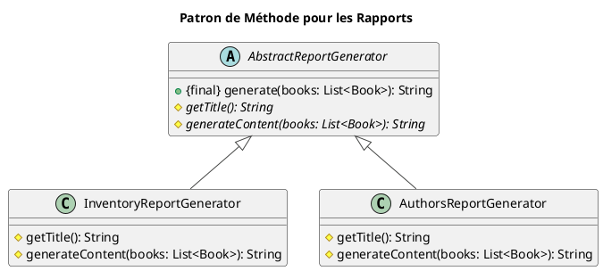

Absolument. Nous arrivons à un point crucial de notre formation. Vous avez appris les patterns, mais un artisan n'est
pas défini par ses outils, mais par sa capacité à les choisir et à les utiliser avec sagesse. Ce module est dédié à cet
art.

---

# Application, Bonnes Pratiques et Anti-Patterns

## Objectifs Pédagogiques

À la fin de ce module, vous serez capable de :

* **Identifier** les "code smells" (mauvaises odeurs de code) qui signalent un besoin de refactoring.
* **Appliquer** plusieurs patterns en combinaison pour résoudre un problème de conception complexe.
* **Effectuer** un refactoring guidé d'un code legacy vers une solution basée sur des patterns.
* **Expliquer** les liens profonds entre les patterns et les principes S.O.L.I.D.
* **Reconnaître** et **éviter** les anti-patterns courants.

## Introduction : De l'Apprenti à l'Artisan

Imaginez que vous venez de recevoir une magnifique boîte à outils remplie de marteaux, de scies et de tournevis de
toutes sortes. C'est formidable ! Mais cela ne fait pas encore de vous un ébéniste. Le véritable savoir-faire consiste à
regarder un simple morceau de bois et à savoir exactement quel outil utiliser, dans quel ordre, pour le transformer en
une œuvre d'art.

C'est là que nous en sommes. Vous avez découvert les patterns de Création, de Structure et de Comportement. Vous avez
les outils. Ce chapitre va vous apprendre à développer votre **intuition de concepteur**. Nous allons prendre un code "
malade", poser un diagnostic, et lui administrer le bon traitement en utilisant nos patterns.

Nous allons également formaliser les liens entre les patterns et les grands principes de conception, et surtout, nous
apprendrons à reconnaître les pièges : les fameux **anti-patterns**, ou l'art d'utiliser le bon outil de la mauvaise
manière.

## L'essentiel : Le Grand Refactoring

Le refactoring (ou ré-usinage) est l'acte d'améliorer la conception interne d'un code sans en changer le comportement
externe. C'est l'un des domaines où les patterns brillent le plus.

### Étude de Cas : Le Générateur de Rapports Infernal

Dans notre application de bibliothèque, la direction demande des rapports. Un premier développeur a créé un service pour
cela. Au début, tout allait bien, mais avec les nouvelles demandes, le service est devenu un monstre.

Voici le code "legacy" que nous devons améliorer.

<warning title="Code Smell en vue !">
Ce code est volontairement mal conçu à des fins pédagogiques. Analysez-le et essayez de repérer les problèmes avant de lire la suite.
</warning>

```java
package fr.formation.spring.app.refactoring.bad;

import fr.formation.spring.app.entities.Book;

import java.util.List;

// Un service qui est devenu très difficile à maintenir.
public class BadReportGenerator {

    // Une méthode "Dieu" qui fait tout.
    public void generateReport(String reportType, String format, List<Book> books) {
        System.out.println("--- DÉBUT DE LA GÉNÉRATION DU RAPPORT ---");

        String content = "";

        // Première structure conditionnelle énorme pour le type de rapport
        if ("INVENTORY".equalsIgnoreCase(reportType)) {
            System.out.println("Génération du contenu pour le rapport d'inventaire...");
            StringBuilder sb = new StringBuilder("Rapport d'inventaire:\n");
            for (Book book : books) {
                sb.append("- ").append(book.getTitle())
                        .append(" (ISBN: ").append(book.getIsbn()).append(")\n");
            }
            content = sb.toString();
        } else if ("AUTHORS".equalsIgnoreCase(reportType)) {
            System.out.println("Génération du contenu pour le rapport des auteurs...");
            StringBuilder sb = new StringBuilder("Rapport des auteurs:\n");
            books.stream()
                    .map(book -> book.getAuthor().getName())
                    .distinct()
                    .forEach(authorName -> sb.append("- ").append(authorName).append("\n"));
            content = sb.toString();
        } else {
            content = "Type de rapport non supporté.";
        }

        // Deuxième structure conditionnelle pour le format de sortie
        if ("HTML".equalsIgnoreCase(format)) {
            System.out.println("Formatage en HTML...");
            String html = "<html><body><pre>" + content + "</pre></body></html>";
            System.out.println("Rapport HTML généré :\n" + html);
            // Logique pour sauvegarder le fichier HTML...
        } else if ("PLAINTEXT".equalsIgnoreCase(format)) {
            System.out.println("Formatage en Texte brut...");
            System.out.println("Rapport Texte généré :\n" + content);
            // Logique pour sauvegarder le fichier .txt...
        } else {
            System.out.println("Format de sortie non supporté.");
        }

        System.out.println("--- FIN DE LA GÉNÉRATION DU RAPPORT ---");
    }
}
```

#### Diagnostic des "Code Smells"

* **Long Method :** La méthode `generateReport` est beaucoup trop longue et complexe.
* **Large Class / God Class :** La classe `BadReportGenerator` a trop de responsabilités : elle connaît la logique de
  *chaque* type de rapport et de *chaque* format de sortie. C'est une violation flagrante du **Principe de
  Responsabilité Unique (SRP)**.
* **Switch Statements / Chained If-Else :** Les longues chaînes de `if-else` sont un signe clair de violation du *
  *Principe Ouvert/Fermé (OCP)**. Pour ajouter un nouveau type de rapport (ex: "CATEGORIES") ou un nouveau format (ex: "
  PDF"), nous devons **modifier** cette classe, ce qui est risqué.
* **Couplage Fort :** La logique de haut niveau est directement couplée aux détails d'implémentation de chaque rapport
  et format.

### Exercice 9 : Le Grand Refactoring

Votre mission, si vous l'acceptez, est de restructurer ce code en appliquant les patterns que nous avons appris.

**Cahier des charges :**

1. **Gérer les formats de sortie :** La logique de formatage (HTML, PlainText) est un algorithme interchangeable. Quel
   pattern utiliser pour la découpler ? Implémentez-le.
2. **Gérer les types de rapport :** La génération du contenu d'un rapport suit un processus similaire (titre, contenu,
   etc.) mais les détails diffèrent. Quel pattern permet de définir un "squelette" d'algorithme tout en laissant les
   sous-classes remplir les détails ? Implémentez-le.
3. **Simplifier l'utilisation :** Une fois les deux étapes précédentes réalisées, le code client pour choisir le bon
   rapport et le bon format peut devenir complexe. Quel pattern permet de masquer cette complexité derrière une
   interface simple ? Implémentez-le.
4. Écrivez un code client (par exemple, une méthode `main`) qui utilise votre nouvelle structure pour générer un rapport
   d'inventaire en HTML.

### Correction exercice 9 {collapsible='true''}

Excellent ! C'est un exercice de synthèse parfait. Voici comment nous pouvons démanteler le monstre et le reconstruire
de manière propre et extensible.

Nous allons créer un nouveau package `fr.formation.spring.app.refactoring.good`.

#### Étape 1 : Gérer les formats de sortie avec le Pattern Strategy

La logique de formatage est un algorithme que l'on veut pouvoir changer à la volée. C'est le cas d'usage parfait pour le
pattern **Strategy**.

##### Diagramme UML

<code-block lang="plantuml">
@startuml
!theme vibrant
title "Stratégies de Formatage de Sortie"

interface OutputStrategy {

+ format(content: String): void
  }

class HtmlOutputStrategy implements OutputStrategy {

+ format(content: String): void
  }
  class PlainTextOutputStrategy implements OutputStrategy {
+ format(content: String): void
  }
  @enduml

</code-block>

##### Le code

```java
// OutputStrategy.java
package fr.formation.spring.app.refactoring.good.strategy;

public interface OutputStrategy {
    void format(String content);
}

// HtmlOutputStrategy.java
package fr.formation.spring.app.refactoring.good.strategy;

public class HtmlOutputStrategy implements OutputStrategy {
    @Override
    public void format(String content) {
        String html = "<html><body><pre>" + content + "</pre></body></html>";
        System.out.println("Rapport HTML généré :\n" + html);
    }
}

// PlainTextOutputStrategy.java
package fr.formation.spring.app.refactoring.good.strategy;

public class PlainTextOutputStrategy implements OutputStrategy {
    @Override
    public void format(String content) {
        System.out.println("Rapport Texte généré :\n" + content);
    }
}
```

**Bénéfice :** Pour ajouter un format PDF, on crée une classe `PdfOutputStrategy`. Le reste du code n'est pas impacté. *
*OCP respecté !**

#### Étape 2 : Gérer les types de rapport avec le Pattern Template Method

Chaque rapport suit un squelette commun : générer un titre, puis un contenu. C'est le cas d'usage parfait pour le *
*Template Method**.

##### Diagramme UML {id="diagramme-uml_2"}



##### Le code {id="le-code_2"}

```java
// AbstractReportGenerator.java
package fr.formation.spring.app.refactoring.good.templatemethod;

import fr.formation.spring.app.entities.Book;

import java.util.List;

public abstract class AbstractReportGenerator {

    // Le patron de méthode, final pour ne pas être redéfini.
    public final String generate(List<Book> books) {
        StringBuilder report = new StringBuilder();
        report.append(getTitle()).append("\n");
        report.append("----------------------------\n");
        report.append(generateContent(books));
        return report.toString();
    }

    // Méthodes abstraites que les sous-classes doivent implémenter.
    protected abstract String getTitle();

    protected abstract String generateContent(List<Book> books);
}

// InventoryReportGenerator.java
package fr.formation.spring.app.refactoring.good.templatemethod;

// ...
public class InventoryReportGenerator extends AbstractReportGenerator {
    @Override
    protected String getTitle() {
        return "Rapport d'inventaire";
    }

    @Override
    protected String generateContent(List<Book> books) {
        StringBuilder sb = new StringBuilder();
        for (Book book : books) {
            sb.append("- ").append(book.getTitle())
                    .append(" (ISBN: ").append(book.getIsbn()).append(")\n");
        }
        return sb.toString();
    }
}

// AuthorsReportGenerator.java
package fr.formation.spring.app.refactoring.good.templatemethod;

// ...
public class AuthorsReportGenerator extends AbstractReportGenerator {
    @Override
    protected String getTitle() {
        return "Rapport des Auteurs";
    }

    @Override
    protected String generateContent(List<Book> books) {
        StringBuilder sb = new StringBuilder();
        books.stream()
                .map(book -> book.getAuthor().getName())
                .distinct()
                .forEach(name -> sb.append("- ").append(name).append("\n"));
        return sb.toString();
    }
}
```

**Bénéfice :** Pour ajouter un rapport sur les catégories, on crée `CategoryReportGenerator`. Le squelette de génération
est préservé. **OCP respecté !**

#### Étape 3 : Simplifier l'utilisation avec le Pattern Facade

Le client doit maintenant instancier le bon générateur ET la bonne stratégie. C'est complexe. On cache tout ça derrière
une **Facade**.

##### Diagramme UML {id="diagramme-uml_1"}

<code-block lang="plantuml">
@startuml
!theme vibrant
title "Façade pour le Système de Reporting"
class ReportingFacade {
  + generateReport(...)
}
Client -> ReportingFacade

package "Système de Reporting" {
ReportingFacade --> AbstractReportGenerator
ReportingFacade --> OutputStrategy
}
@enduml
</code-block>

##### Le code {id="le-code_1"}

```java
// ReportingFacade.java
package fr.formation.spring.app.refactoring.good;

import fr.formation.spring.app.entities.Book;
import fr.formation.spring.app.refactoring.good.strategy.*;
import fr.formation.spring.app.refactoring.good.templatemethod.*;

import java.util.List;
import java.util.Map;

public class ReportingFacade {
    // On peut utiliser une Map pour une Factory simple
    private final Map<String, AbstractReportGenerator> reportGenerators;
    private final Map<String, OutputStrategy> outputStrategies;

    public ReportingFacade() {
        reportGenerators = Map.of(
                "INVENTORY", new InventoryReportGenerator(),
                "AUTHORS", new AuthorsReportGenerator()
        );
        outputStrategies = Map.of(
                "HTML", new HtmlOutputStrategy(),
                "PLAINTEXT", new PlainTextOutputStrategy()
        );
    }

    public void generateReport(String reportType, String format, List<Book> books) {
        AbstractReportGenerator generator = reportGenerators.get(reportType.toUpperCase());
        OutputStrategy outputStrategy = outputStrategies.get(format.toUpperCase());

        if (generator == null || outputStrategy == null) {
            System.err.println("Type de rapport ou format non supporté.");
            return;
        }

        System.out.println("--- DÉBUT (via Façade) ---");
        String content = generator.generate(books);
        outputStrategy.format(content);
        System.out.println("--- FIN (via Façade) ---");
    }
}
```

#### Étape 4 : Le code client, propre et simple

```java
public class TestRefactoring {
    public static void main(String[] args) {
        // Le client ne connaît plus les détails complexes.
        ReportingFacade facade = new ReportingFacade();

        // Préparation des données... (non montré)
        List<Book> bookList = ...;

        System.out.println(">>> Génération d'un rapport d'inventaire en HTML :");
        facade.generateReport("INVENTORY", "HTML", bookList);

        System.out.println("\n>>> Génération d'un rapport des auteurs en texte brut :");
        facade.generateReport("AUTHORS", "PLAINTEXT", bookList);
    }
}
```

Nous avons transformé un code rigide et monolithique en un système flexible, modulaire et facile à étendre. C'est la
puissance des Design Patterns en action.

## Pour aller plus loin

### La Danse des Patterns et des Principes S.O.L.I.D.

Vous l'avez vu dans le refactoring : les patterns ne sont pas des inventions arbitraires. Ils sont souvent des
applications concrètes des principes S.O.L.I.D. Comprendre ce lien renforce votre intuition.

* **S - Single Responsibility Principle :**
    * **Facade :** La façade a la seule responsabilité de simplifier l'accès. Les classes du sous-système gardent leurs
      propres responsabilités.
    * **Command :** Une commande a la seule responsabilité d'encapsuler une requête.

* **O - Open/Closed Principle :** C'est le principe roi pour beaucoup de patterns.
    * **Strategy, Observer, Decorator :** Ils permettent d'ajouter de nouveaux comportements (stratégies, observateurs,
      décorations) en ajoutant de nouvelles classes, sans modifier le code client.
    * **Template Method :** Permet d'étendre un algorithme sans modifier son squelette.

* **L - Liskov Substitution Principle :**
    * Le fondement de tous les patterns basés sur le polymorphisme. Une `ConcreteStrategy` doit pouvoir remplacer
      l'interface `Strategy` sans casser le programme. Idem pour `State`, `Observer`, etc.

* **I - Interface Segregation Principle :**
    * **Adapter :** Le client dépend de l'interface `Target` qui est petite et spécifique à son besoin, pas de la grosse
      interface potentielle de l'`Adaptee`.
    * **Observer :** L'interface `Observer` est souvent très petite (`update()`), ne forçant pas les observateurs à
      implémenter des méthodes dont ils n'ont pas besoin.

* **D - Dependency Inversion Principle :**
    * **Factory Method, Abstract Factory :** Le client dépend d'une abstraction (interface `Product` ou
      `AbstractFactory`), pas d'une implémentation concrète. La fabrique se charge de l'inversion de dépendance.
    * **Strategy, State :** Le `Context` dépend de l'interface `Strategy` ou `State`, pas des implémentations concrètes.

### Les Anti-Patterns : Les Pièges à Éviter

Un anti-pattern est une solution couramment utilisée à un problème, mais qui est inefficace et crée plus de problèmes
qu'elle n'en résout.

<tabs>
<tab title="The Golden Hammer (Le Marteau d'Or)">
    <p><b>Description :</b> C'est l'anti-pattern du "je viens d'apprendre un nouveau truc cool et je vais l'utiliser PARTOUT". Si vous venez de maîtriser le pattern Strategy, vous risquez de l'appliquer même là où un simple <code>if</code> suffirait.</p>
    <p><b>Symptôme :</b> Sur-ingénierie (over-engineering). Des solutions inutilement complexes pour des problèmes simples.</p>
    <p><b>Remède :</b> Gardez votre esprit critique. Demandez-vous toujours : "Est-ce que la complexité ajoutée par ce pattern est justifiée par la flexibilité que j'y gagne ?". Le principe <b>YAGNI</b> ("You Ain't Gonna Need It" - Tu n'en auras pas besoin) est votre meilleur ami.</p>
</tab>
<tab title="God Object / God Class (Objet Divin)">
    <p><b>Description :</b> Une classe qui sait tout et fait tout. C'est l'exact opposé du Principe de Responsabilité Unique.</p>
    <p><b>Symptôme :</b> Des classes de plusieurs milliers de lignes, avec des dizaines de méthodes et de dépendances. Elles sont impossibles à tester et à maintenir.</p>
    <p><b>Remède :</b> Le refactoring ! Utilisez des patterns comme <b>Facade</b> pour cacher la complexité, et extrayez des responsabilités dans de nouvelles classes plus petites (potentiellement en utilisant <b>Strategy</b>, <b>Command</b>, etc.).</p>
</tab>
<tab title="Singletonitis (La Singleton-ite)">
    <p><b>Description :</b> L'abus du pattern Singleton. Utiliser des singletons pour tout et n'importe quoi, simplement pour avoir un accès global facile.</p>
    <p><b>Symptôme :</b> Un code difficile à tester (comment mocker un appel statique à <code>MySingleton.getInstance()</code> ?), un couplage fort, et un état global caché qui peut provoquer des effets de bord imprévisibles.</p>
    <p><b>Remède :</b> L'<b>Inversion de Contrôle (IoC)</b> et l'<b>Injection de Dépendances</b>. Au lieu que votre classe aille chercher sa dépendance (`getInstance()`), la dépendance lui est fournie (via un constructeur). Les frameworks comme Spring font ça pour vous. La plupart du temps, un bean avec une portée "singleton" dans Spring est une bien meilleure solution qu'un Singleton manuel.</p>
</tab>
</tabs>

## Auto-évaluation

Consolidons ces notions avancées.

<warning>
Les corrections de cette auto-évaluation se trouvent à la fin de l'ensemble du support de cours.
</warning>

**Questions à Choix Multiple (QCM)**

1. Vous trouvez dans une base de code une méthode de 500 lignes contenant de multiples `if/else` imbriqués. Quel est
   le "code smell" le plus évident ?
    * a) Duplication de code
    * b) Long Method
    * c) Lazy Class
    * d) Data Clump

2. Le Principe Ouvert/Fermé (OCP) est particulièrement bien illustré par quel trio de patterns ?
    * a) Singleton, Builder, Prototype
    * b) Facade, Adapter, Proxy
    * c) Strategy, Decorator, Observer
    * d) Command, State, Memento

3. Un développeur de votre équipe utilise le pattern Strategy pour gérer un choix entre deux options qui ne changeront
   jamais. C'est un exemple probable de quel anti-pattern ?
    * a) God Object
    * b) Singletonitis
    * c) Spaghetti Code
    * d) The Golden Hammer

4. Quelle est la meilleure alternative moderne à l'implémentation manuelle du pattern Singleton dans une application
   Spring ?
    * a) Créer une classe statique.
    * b) Utiliser l'injection de dépendances et la portée "singleton" des beans Spring.
    * c) Utiliser le pattern Prototype.
    * d) Utiliser une variable globale.

**Questions Ouvertes**

5. Expliquez pourquoi le refactoring est un processus itératif et pourquoi il est important d'avoir une bonne suite de
   tests avant de commencer à refactorer.
6. Donnez un exemple de situation où l'utilisation d'une Facade pourrait être un "pansement" sur une mauvaise
   conception, et où un refactoring plus profond du sous-système serait préférable.

## Conclusion

Ce chapitre était peut-être le plus important de tous. Connaître les patterns, c'est bien. Savoir quand, pourquoi et
comment les utiliser – et quand ne PAS les utiliser – c'est ce qui fait un excellent concepteur.

Vous avez appris à :

* **Diagnostiquer** un code malade en identifiant les "code smells".
* **Guérir** ce code en appliquant une combinaison de patterns (Strategy, Template Method, Facade) pour le rendre
  flexible et maintenable.
* **Connecter** la théorie (S.O.L.I.D.) à la pratique (Patterns).
* **Reconnaître** les pièges des anti-patterns pour ne pas tomber dedans.

Vous êtes maintenant équipé non seulement des outils, mais aussi du discernement pour les utiliser. Le dernier module
sera une conclusion rapide, un récapitulatif de notre voyage et des pistes pour continuer à apprendre toute votre vie.