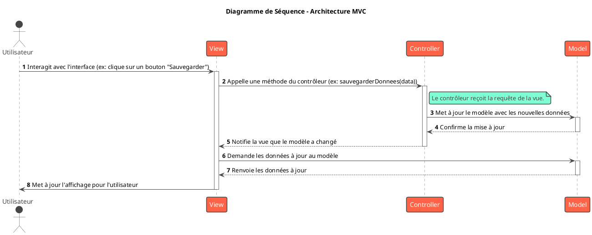

# Hors-Série : Patterns Modernes et d'Architecture

## Objectifs Pédagogiques

À la fin de ce module bonus, vous serez capable de :

* **Comprendre** le principe fondamental de l'Inversion de Contrôle (IoC).
* **Distinguer** les patterns Dependency Injection et Service Locator.
* **Implémenter** le pattern Dependency Injection (DI) en Java pur et comprendre comment Spring l'automatise.
* **Maîtriser** le pattern DTO (Data Transfer Object) pour créer des API robustes et sécurisées.
* **Décrire** l'architecture MVC (Model-View-Controller) et son application dans un projet Spring Boot.

## Introduction : Le Monde a Changé Depuis 1994

Les patterns du "Gang of Four" ont été définis à une époque où les applications étaient souvent de grands monolithes et
où les développeurs géraient manuellement la création et la liaison de leurs objets.

Depuis, deux révolutions ont eu lieu :

1. **L'avènement des frameworks avec Inversion de Contrôle (IoC)**, comme Spring.
2. **La généralisation des architectures distribuées et des API web**, qui posent de nouveaux problèmes de communication
   et de sécurité.

De ces révolutions sont nés de nouveaux patterns ou des manières différentes d'appliquer les anciens. Ce chapitre se
concentre sur les patterns que vous utiliserez tous les jours en tant que Concepteur Développeur d'Application dans un
écosystème moderne.

## Le Principe Fondamental : L'Inversion de Contrôle (IoC)

Avant de parler des patterns, il faut comprendre le principe qui les sous-tend : l'**Inversion de Contrôle (IoC)**.

* **Contrôle normal :** Votre code crée et contrôle ses dépendances.
  `MyService service = new MyDependency(); service.doWork();`. Votre code est aux commandes.
* **Inversion de Contrôle :** Vous déléguez la création et la gestion de vos objets à une entité externe (un conteneur,
  un framework). Votre code ne dit plus "je veux un `MyDependency`", il dit "j'ai besoin d'un `MyDependency` pour
  fonctionner". Le framework lui fournit.

C'est le **"Principe Hollywood"** : "Ne nous appelez pas, c'est nous qui vous appellerons."

L'IoC n'est pas un pattern, c'est un **principe de conception**. Dependency Injection et Service Locator sont deux
patterns qui **implémentent** ce principe.

## L'essentiel : Les Patterns du Quotidien

### Le Pattern Dependency Injection (Injection de Dépendances)

C'est LE pattern au cœur de Spring et de la plupart des frameworks modernes.

#### L'intention

**Fournir à un objet ses dépendances depuis l'extérieur, plutôt que de le laisser les créer lui-même.**

Au lieu que votre `BookService` fasse `new BookRepository()`, un "injecteur" (le conteneur Spring) crée le
`BookRepository` et le "passe" au `BookService` au moment de sa création.

Cela applique à la perfection le **Principe d'Inversion des Dépendances (DIP)** : les modules de haut niveau (
`BookService`) ne dépendent plus des modules de bas niveau (`BookRepositoryImpl`), mais d'abstractions (
`BookRepository`).

#### Structure et Implémentation

##### Diagramme UML

<code-block lang="plantuml">
@startuml
!theme vibrant
title "Pattern Dependency Injection"

class Client {

- service: IService
  }
  note right: Le client a besoin d'un service.

interface IService {

+ doSomething()
  }

class ServiceImpl implements IService {

- repository: IRepository

+ ServiceImpl(repo: IRepository)
+ doSomething()
  }
  note top: Le service a besoin d'un repository.\nIl l'exprime via son constructeur.

interface IRepository {

+ getData()
  }
  class RepositoryImpl implements IRepository {
+ getData()
  }

package "Conteneur IoC / Assembleur" {
class Assembler {

+ wireApplication()
  }
  }
  note right of Assembler
  Le conteneur est responsable de :

1. Créer RepositoryImpl
2. Créer ServiceImpl en lui passant RepositoryImpl
3. Créer Client en lui passant ServiceImpl
   end note

Assembler ..> Client : injecte
Assembler ..> ServiceImpl : crée et injecte
Assembler ..> RepositoryImpl : crée

Client -> IService
ServiceImpl ..|> IService
ServiceImpl -> IRepository
RepositoryImpl ..|> IRepository
@enduml
</code-block>

#### Types d'Injection

* **Injection par constructeur (préférée) :** Les dépendances sont passées comme arguments du constructeur.
    * **Avantages :** Garantit que l'objet est toujours dans un état valide dès sa création. Permet de déclarer les
      dépendances comme `final`, assurant l'immutabilité. Les dépendances sont explicites.
* **Injection par setter (méthode) :** Les dépendances sont injectées via des méthodes `set...()`.
    * **Avantages :** Permet de changer les dépendances à la volée (rarement utile) et de gérer les dépendances
      optionnelles.
* **Injection par champ :** La dépendance est injectée directement dans le champ (ex: avec `@Autowired` en Spring).
    * **Inconvénients :** Souvent déconseillée car elle cache les dépendances, rend les tests plus difficiles (nécessite
      la réflexion pour injecter des mocks) et ne permet pas l'immutabilité.

### Exercice 10 : Refactorer vers l'Injection de Dépendances

Dans notre projet, imaginez que le `BookService` n'est pas encore un bean Spring et qu'il crée lui-même ses dépendances.

**Code de départ (à ne pas copier, juste pour l'exemple) :**

```java
public class BookService_BeforeDI {
    // Mauvaise pratique : création manuelle des dépendances
    private final BookRepository bookRepository = new BookRepositoryImpl();
    private final AuthorRepository authorRepository = new AuthorRepositoryImpl();

    // ... méthodes du service ...
}
```

**Votre mission :**

1. Reprenez le `BookService` que nous avons créé dans l'exercice 4 (qui utilise déjà l'injection par constructeur via
   Spring).
2. Identifiez clairement dans le code où se situe l'injection de dépendances.
3. Expliquez en 1 ou 2 phrases pourquoi cette approche est supérieure à la création manuelle avec `new`.

### Correction exercice 10 {collapsible='true''}

Parfait ! Cet exercice est plus une analyse qu'une implémentation, mais il est crucial pour la compréhension.

##### 1 & 2. Analyse du `BookService` existant

Voici le `BookService` de l'exercice 4.

```java
package fr.formation.spring.app.services;
// ... imports ...

@Service // Annotation qui dit à Spring de gérer cette classe
public class BookService {

    // Déclaration des dépendances, sans initialisation !
    private final BookRepository bookRepository;
    private final AuthorRepository authorRepository;
    private final CategoryRepository categoryRepository;

    // C'est ICI que l'injection de dépendances a lieu !
    // Spring va automatiquement trouver un bean de type BookRepository,
    // AuthorRepository, etc., et les passer à ce constructeur.
    public BookService(BookRepository br, AuthorRepository ar, CategoryRepository cr) {
        this.bookRepository = br;
        this.authorRepository = ar;
        this.categoryRepository = cr;
    }

    public Book createBook(BookCreationDTO dto) {
        // ... la logique de la méthode ...
    }
}
```

##### 3. Supériorité de l'approche DI

L'injection de dépendances est supérieure car elle **découple** le `BookService` de l'implémentation concrète de ses
`Repository`. Cela nous permet de remplacer facilement l'implémentation (par exemple, pour passer d'une base de données
H2 à PostgreSQL) ou de fournir des "mocks" (fausses implémentations) lors des tests unitaires, sans jamais avoir à
modifier le code du `BookService`.

### Le Pattern DTO (Data Transfer Object)

Nous l'avons déjà utilisé, mais il est temps de le formaliser comme un pattern à part entière.

#### L'intention {id="l-intention_1"}

**Créer des objets simples (souvent appelés POJOs - Plain Old Java Objects) dont le seul but est de transporter des
données entre les différentes couches d'une application, notamment entre le backend et le client.**

Un DTO est un contrat. Votre entité JPA `Book` peut contenir des informations sensibles (ex: le coût d'achat) ou des
relations complexes que vous ne voulez pas exposer dans une API publique. Le `BookDTO` ne contiendra que les champs
nécessaires et sécuritaires pour le client.

#### Pourquoi utiliser des DTOs ?

* **Sécurité :** Empêche l'exposition accidentelle de données sensibles. Vous ne mettez que ce que le client a le droit
  de voir.
* **Stabilité de l'API :** Vous pouvez refactorer votre modèle de domaine (vos entités JPA) sans casser le contrat de
  votre API, tant que vous maintenez la structure du DTO.
* **Performance :** Évite les problèmes de chargement paresseux (Lazy Loading) de JPA qui peuvent se déclencher lors de
  la sérialisation JSON et évite de charger des données inutiles.
* **Clarté :** Le DTO définit exactement ce qu'une requête attend ou ce qu'une réponse va fournir.

### Exercice 11 : Créer un DTO et un Mapper

Nous allons créer un DTO pour l'affichage d'un livre, qui est différent du DTO de création. Ce DTO n'exposera que des
informations simples.

**Cahier des charges :**

1. Créez un `BookViewDTO` dans le package `dto`. Il contiendra : `id`, `title`, `authorName` (un `String`), et
   `categoryNames` (un `Set<String>`).
2. Créez une classe `BookMapper` dans un nouveau package `fr.formation.spring.app.mappers`. Cette classe aura une
   méthode statique `toDto(Book book)` qui convertit une entité `Book` en `BookViewDTO`.
3. Dans le `BookController`, ajoutez un endpoint `GET /api/books/{id}` qui retourne un `BookViewDTO`. Ce endpoint
   utilisera le `BookMapper`.
4. Fournissez la requête HTTP pour tester et montrez le JSON attendu en réponse.

### Correction exercice 11 {collapsible='true''}

C'est une tâche quotidienne pour un développeur backend. Voici la solution.

##### 1. Le `BookViewDTO.java`

```java
package fr.formation.spring.app.dto;

import lombok.Getter;
import lombok.Setter;

import java.util.Set;

@Getter
@Setter
public class BookViewDTO {
    private Long id;
    private String title;
    private String authorName;
    private Set<String> categoryNames;
}
```

##### 2. Le `BookMapper.java`

```java
package fr.formation.spring.app.mappers;

import fr.formation.spring.app.dto.BookViewDTO;
import fr.formation.spring.app.entities.Book;
import fr.formation.spring.app.entities.Category;

import java.util.stream.Collectors;

public class BookMapper {

    // Pas d'instanciation nécessaire, la classe ne contient que des méthodes statiques.
    private BookMapper() {
    }

    public static BookViewDTO toDto(Book book) {
        if (book == null) {
            return null;
        }

        BookViewDTO dto = new BookViewDTO();
        dto.setId(book.getId());
        dto.setTitle(book.getTitle());

        if (book.getAuthor() != null) {
            dto.setAuthorName(book.getAuthor().getName());
        }

        if (book.getCategories() != null) {
            dto.setCategoryNames(
                    book.getCategories().stream()
                            .map(Category::getName)
                            .collect(Collectors.toSet())
            );
        }

        return dto;
    }
}
```

<tip>Dans un projet réel, on utilise souvent des librairies comme **MapStruct** ou **ModelMapper** pour automatiser la création de ce code de mapping répétitif.</tip>

##### 3. Le `BookController` mis à jour

Ajoutez cette méthode au `BookController.java`.

```java
// ... dans BookController.java ...

import fr.formation.spring.app.dto.BookViewDTO;
import fr.formation.spring.app.mappers.BookMapper;
import jakarta.persistence.EntityNotFoundException;
// ...

@GetMapping("/{id}")
public ResponseEntity<BookViewDTO> getBookById(@PathVariable Long id) {
    Book book = bookRepository.findById(id)
            .orElseThrow(() -> new EntityNotFoundException("Livre non trouvé avec l'id " + id));

    // Utilisation du mapper pour convertir l'entité en DTO
    BookViewDTO bookDto = BookMapper.toDto(book);

    return ResponseEntity.ok(bookDto);
}
```

##### 4. Test de l'API

Requête HTTP :

```http
### Récupérer un livre par son ID
GET http://localhost:8080/api/books/1
```

JSON de réponse attendu :

```json
{
  "id": 1,
  "title": "Dune",
  "authorName": "Frank Herbert",
  "categoryNames": [
    "Science-Fiction"
  ]
}
```

## Pour aller plus loin

### Le Pattern Service Locator

C'est l'autre pattern qui implémente l'IoC. Il est moins utilisé dans les écosystèmes modernes comme Spring, mais il est
bon de le connaître.

* **Intention :** Avoir un objet central (le "localisateur") qui sait comment obtenir tous les services dont
  l'application a besoin.
* **Fonctionnement :** Une classe qui a besoin d'un service ne le reçoit pas par injection. Elle demande au
  `ServiceLocator` de le lui fournir : `MyService srv = ServiceLocator.getService("myService");`.
* **Comparaison avec DI :**
    * Le Service Locator **cache les dépendances**. En lisant le constructeur d'une classe, vous ne voyez pas ce dont
      elle a besoin. Elle peut appeler le `ServiceLocator` n'importe où dans son code.
    * La Dependency Injection rend les dépendances **explicites** (dans le constructeur ou les setters). C'est
      généralement considéré comme une meilleure pratique car c'est plus clair et plus facile à tester.

### Le Pattern d'Architecture MVC (Model-View-Controller)

C'est le pattern d'architecture le plus célèbre pour les applications interactives.

* **Intention :** Séparer les préoccupations d'une application en trois rôles interconnectés.
* **Les Rôles :**
    * **Model (Modèle) :** Les données de l'application et la logique métier. Dans notre projet, ce sont nos entités (
      `Book`, `Author`) et nos services (`BookService`). C'est le cœur de l'application.
    * **View (Vue) :** La représentation visuelle du modèle. C'est ce que l'utilisateur voit. Dans une API REST, la "
      vue" est la représentation des données (ex: le JSON). Dans une application web traditionnelle, c'est la page
      HTML (générée par Thymeleaf, JSP, etc.).
    * **Controller (Contrôleur) :** Reçoit les entrées de l'utilisateur (requêtes HTTP), interagit avec le modèle pour
      effectuer des actions, et choisit la vue à renvoyer. Dans notre projet, `BookController` est notre contrôleur.

#### Diagramme de flux MVC




## Auto-évaluation

Testez vos connaissances sur ces patterns essentiels de l'écosystème moderne.


**Questions à Choix Multiple (QCM)**

1. Quel est le principal avantage de l'injection par constructeur ?
    * a) Elle permet de changer les dépendances après la création de l'objet.
    * b) Elle garantit que l'objet est créé dans un état valide avec toutes ses dépendances obligatoires.
    * c) C'est la seule façon de faire de l'injection de dépendances.
    * d) Elle est plus performante que l'injection par champ.

2. Le pattern DTO est principalement utilisé pour :
    * a) Définir la logique métier de l'application.
    * b) Gérer les transactions avec la base de données.
    * c) Transporter des données entre les couches et découpler le modèle de domaine de l'API.
    * d) Remplacer le pattern Service.

3. Dans une architecture MVC, quelle est la responsabilité du Contrôleur ?
    * a) Afficher les données à l'utilisateur.
    * b) Contenir la logique métier et les données.
    * c) Recevoir les requêtes, interagir avec le modèle et sélectionner une vue.
    * d) Se connecter directement à la base de données.

4. La principale différence entre Dependency Injection (DI) et Service Locator est :
    * a) DI est un pattern, Service Locator est un principe.
    * b) Avec DI, les dépendances sont poussées dans l'objet de l'extérieur ; avec Service Locator, l'objet va chercher
      activement ses dépendances.
    * c) Service Locator est plus facile à tester que DI.
    * d) Il n'y a pas de différence, ce sont deux noms pour la même chose.

**Questions Ouvertes**

5. Expliquez avec vos propres mots le "Principe Hollywood" et comment il se rapporte à l'Inversion de Contrôle.
6. Vous créez un endpoint pour mettre à jour un profil utilisateur. Pourquoi est-il crucial d'utiliser un
   `UserUpdateDTO` plutôt que d'accepter directement une entité `User` dans la requête `PUT` ?

## Conclusion

Ce module bonus vous a armé des patterns et principes qui gouvernent le développement d'applications modernes.
Contrairement à certains patterns du GoF qui sont plus situationnels, vous utiliserez **Dependency Injection**, **DTO**
et **MVC** (ou ses variantes) dans quasiment **tous les projets professionnels** sur lesquels vous travaillerez.

Les comprendre en profondeur, ce n'est pas seulement savoir utiliser un framework comme Spring. C'est comprendre le **"
pourquoi"** derrière son fonctionnement. C'est ce qui vous permettra de l'utiliser à son plein potentiel, de débugger
des problèmes complexes et, ultimement, de concevoir des applications non seulement fonctionnelles, mais aussi propres,
sécurisées et évolutives.

Vous êtes maintenant prêt à affronter le monde du développement professionnel avec une solide fondation en conception
logicielle.

