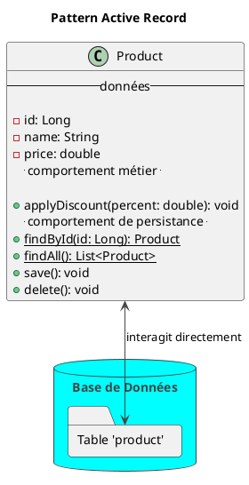
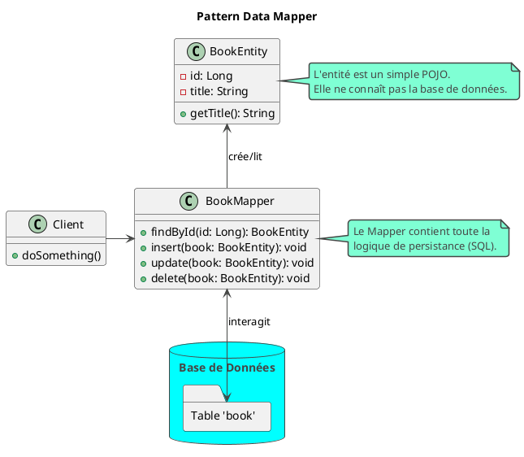

# Hors-Série : Patterns de Persistance et ORM

## Objectifs Pédagogiques

À la fin de ce module, vous serez en mesure de :

* **Définir** ce qu'est un ORM et le problème qu'il résout.
* **Distinguer** les deux principaux patterns de persistance d'objets : **Active Record** et **Data Mapper**.
* **Expliquer** pourquoi l'écosystème Java (avec JPA/Hibernate) a massivement adopté le pattern Data Mapper.
* **Comprendre** les rôles des patterns **DAO (Data Access Object)** et **Repository**.
* **Reconnaître** comment Spring Data JPA implémente et étend ces patterns pour nous simplifier la vie.

## Introduction : Le Pont entre Deux Mondes

Dans une application, nous vivons dans un monde d'objets : des `Book`, des `Author`, avec des méthodes, des relations et
des comportements. Mais nos données, elles, vivent dans un monde de tables, de lignes et de colonnes : le monde
relationnel des bases de données SQL.

Ces deux mondes ne parlent pas la même langue. Historiquement, les développeurs passaient un temps fou à écrire du code
de "traduction" répétitif (le fameux code JDBC) pour faire le pont entre ces deux univers. C'est le problème de l'**"
impedance mismatch" objet-relationnel**.

Un **ORM (Object-Relational Mapping)** est un outil qui construit ce pont pour nous. Et comme pour tout problème de
conception, il existe des **patterns** pour construire ce pont. Comprendre ces patterns, c'est comprendre le
fonctionnement profond de JPA/Hibernate et savoir pourquoi notre code de persistance est structuré comme il l'est.

## L'essentiel : Les Deux Grandes Philosophies

Il existe deux approches radicalement différentes pour mapper les objets à la base de données.

### Le Pattern Active Record

#### L'intention {id="l-intention_1"}

**Un objet encapsule à la fois les données (ses attributs) et le comportement de persistance (CRUD - Create, Read,
Update, Delete).**

Dans ce pattern, l'objet métier *sait* comment se sauvegarder, se supprimer ou se retrouver en base. C'est un objet
autonome, un véritable couteau suisse pour ses propres données.

#### Structure et Implémentation {id="structure-et-impl-mentation_1"}

##### Diagramme UML {id="diagramme-uml_1"}



##### Exemple Conceptuel

<warning title="Attention !">
Ce code est un exemple conceptuel. Ce n'est **PAS** comme cela que l'on fait avec JPA/Hibernate. Il est ici pour illustrer le principe.
</warning>

```java
// Exemple conceptuel du pattern Active Record
public class ProductRecord {
    private Long id;
    private String name;
    private double price;

    // Getters et Setters...

    public void save() {
        // Le code JDBC pour faire un INSERT ou un UPDATE serait ici.
        // L'objet utilise une connexion à la BDD pour se sauvegarder lui-même.
        System.out.println("Sauvegarde de " + this.name + " en base...");
        // Ex: if (this.id == null) { INSERT ... } else { UPDATE ... }
    }

    public void delete() {
        // Le code JDBC pour faire un DELETE serait ici.
        System.out.println("Suppression de " + this.name + " de la base...");
    }

    public static ProductRecord findById(Long id) {
        // Le code JDBC pour faire un SELECT ... WHERE id = ? serait ici.
        System.out.println("Recherche du produit " + id);
        return new ProductRecord(); // Simule le retour de l'objet trouvé
    }
}
```

* **Avantages :** Très simple à comprendre et à utiliser pour des applications CRUD basiques. La logique est directement
  sur l'objet, c'est rapide à développer.
* **Inconvénients :** Viole le **Principe de Responsabilité Unique (SRP)**. L'objet métier (`Product`) est maintenant
  aussi responsable de sa persistance. Cela mélange la logique métier et la logique d'accès aux données, ce qui rend
  l'objet difficile à tester (il faut une base de données pour tester une méthode métier) et à maintenir dans des
  domaines complexes.

### Le Pattern Data Mapper

#### L'intention

**Créer une couche de "mappage" séparée qui est responsable de la synchronisation entre les objets en mémoire et la base
de données.**

Dans ce pattern, les objets métier (les Entités) sont "purs". Ils ne connaissent rien à la base de données. Ce sont de
simples POJOs qui contiennent des données et de la logique métier. Un objet tiers, le `Mapper`, s'occupe de la
traduction.

C'est la philosophie adoptée par **JPA et Hibernate**.

#### Structure et Implémentation

##### Diagramme UML



<tip title="Qui est le Data Mapper dans JPA/Hibernate ?">
Le **`EntityManager`** de JPA (ou la `Session` de Hibernate) **est l'implémentation du pattern Data Mapper**. C'est lui qui sait comment transformer vos objets en requêtes SQL et vice-versa.
</tip>

* **Avantages :** Respecte le **Principe de Responsabilité Unique**. Les objets métier sont complètement indépendants de
  la persistance, ce qui les rend faciles à tester unitairement. Cette séparation permet de gérer des mappings complexes
  et d'optimiser la persistance (gestion de cache, requêtes optimisées) sans "polluer" le modèle métier.
* **Inconvénients :** Ajoute une couche d'abstraction supplémentaire, ce qui peut sembler plus complexe au premier abord
  pour des opérations CRUD simples.

<tabs>
<tab title="Comparaison : Active Record vs. Data Mapper">
<table>
| Critère | Active Record | Data Mapper (JPA/Hibernate) |
|---|---|---|
| **Responsabilité** | L'objet est responsable de sa propre persistance. | Une classe `Mapper` séparée est responsable. |
| **Principe SRP** | Violé. | Respecté. |
| **Testabilité** | Difficile, l'objet métier dépend de la BDD. | Facile, l'objet métier est un POJO. |
| **Couplage** | Fort entre le modèle métier et la persistance. | Faible, les deux sont découplés. |
| **Complexité** | Simple pour les cas d'usage CRUD. | Plus adaptable aux domaines métier complexes. |
| **Exemples** | Ruby on Rails, Laravel (PHP) | **JPA/Hibernate (Java)**, SQLAlchemy (Python) |
</table>
</tab>
</tabs>

## Pour aller plus loin : Les Patterns d'Accès aux Données

Une fois qu'on a choisi la philosophie Data Mapper, on utilise souvent des patterns supplémentaires pour structurer
l'accès à ce mapper.

### Le Pattern DAO (Data Access Object)

* **Intention :** Abstraire et encapsuler tous les accès à la source de données. Le DAO fournit une interface avec des
  opérations CRUD, cachant les détails de l'implémentation de la persistance (comment on utilise l'`EntityManager`).
* **Structure :** Typiquement une interface (`BookDAO`) et une ou plusieurs implémentations (`BookDAOImpl`). Le reste de
  l'application (les services) ne dépend que de l'interface.

```java
// Interface DAO
public interface BookDAO {
    Book findById(long id);

    void save(Book book);
    // ...
}

// Implémentation du DAO avec JPA
public class BookDAOImpl implements BookDAO {
    // Dans un vrai projet, l'EntityManager serait injecté
    private EntityManager em;

    @Override
    public Book findById(long id) {
        return em.find(Book.class, id);
    }
    // ...
}
```

### Le Pattern Repository

Le Repository est une évolution moderne du DAO, popularisée par le Domain-Driven Design (DDD).

* **Intention :** Fournir une **illusion de collection en mémoire** pour les objets du domaine. Le client manipule le
  Repository comme s'il s'agissait d'une `List` ou d'une `Map`, sans se soucier de la persistance.
* **Différence avec le DAO :** Un DAO est souvent centré sur une table et expose des opérations CRUD de bas niveau. Un
  Repository est centré sur un **Agrégat** (un groupe d'objets métier, comme une `Commande` avec ses `LignesDeCommande`)
  et expose des méthodes qui ont un sens métier.
* **Exemple :** Au lieu de `save(user)` et `save(address)`, un `UserRepository` pourrait avoir une seule méthode
  `save(user)` qui se charge de sauvegarder l'utilisateur *et* son adresse, car ils font partie du même agrégat.

<warning title="Le lien avec Spring Data JPA">
<strong>Spring Data JPA est une implémentation du pattern Repository.</strong>
Quand vous créez une interface 
<code>public interface BookRepository extends JpaRepository&lt;Book, Long&gt; { ... }</code>, 
vous définissez un Repository. Spring se charge de :
1.  Fournir une implémentation concrète de cette interface à la volée.
2.  Utiliser en interne <code>EntityManager</code> (le <strong>Data Mapper</strong>) pour exécuter les requêtes.

Vous bénéficiez donc de la puissance de ces patterns sans avoir à écrire le code de plomberie !
</warning>

### Exercice 12 : Analyse de notre architecture de persistance

Cet exercice est une pure analyse de notre projet fil rouge. Vous n'avez pas de code à écrire, mais des réponses à
formuler.

**Votre mission :**
En observant les classes `Book`, `BookRepository`, et le framework Spring Data JPA qui les fait fonctionner, répondez
aux questions suivantes :

1. Quel pattern principal de mapping objet-relationnel est utilisé ? Justifiez en décrivant le rôle de la classe `Book`.
2. Quel pattern d'accès aux données est représenté par l'interface `BookRepository` ?
3. Qui joue le rôle du "Data Mapper" effectif dans notre application ?
4. Si nous avions suivi le pattern Active Record, quelles sortes de méthodes trouverait-on directement dans la classe
   `Book` ?

### Correction exercice 12 {collapsible='true''}

Excellente analyse ! Voici les réponses qui démontrent une compréhension profonde de l'architecture.

1. **Pattern de mapping :** Le pattern utilisé est le **Data Mapper**. La classe `Book` est une simple entité (POJO
   annoté avec `@Entity`). Elle contient des données et pourrait contenir de la logique métier, mais elle est
   complètement ignorante de la manière dont elle est sauvegardée. Elle n'a aucune méthode `.save()` ou `.find()`. Sa
   responsabilité est purement liée au domaine "Livre".

2. **Pattern d'accès aux données :** L'interface `BookRepository` représente le **Pattern Repository**. Elle fournit une
   abstraction de haut niveau, similaire à une collection, pour accéder aux entités `Book` (ex: `findAll()`,
   `findById()`, `save()`).

3. **Le Data Mapper :** Dans notre application Spring Boot/JPA, le rôle du Data Mapper est joué par l'**`EntityManager`
   de JPA**, qui est implémenté par la **`Session` de Hibernate** sous le capot. C'est Spring Data qui orchestre l'
   utilisation de cet `EntityManager` pour nous lorsque nous appelons les méthodes de notre `BookRepository`.

4. **En Active Record :** Si nous avions suivi ce pattern, la classe `Book` elle-même aurait contenu des méthodes
   statiques et d'instance pour la persistance, comme :
    * `public void save()`
    * `public void delete()`
    * `public static Book findById(Long id)`
    * `public static List<Book> findByTitle(String title)`

## Auto-évaluation

Vérifiez que vous maîtrisez bien ces concepts fondamentaux de la persistance.

**Questions à Choix Multiple (QCM)**

1. La principale caractéristique du pattern Active Record est :
    * a) Il sépare la logique métier de la logique de persistance.
    * b) Il utilise un objet `Mapper` pour communiquer avec la base de données.
    * c) L'objet métier contient lui-même les méthodes pour se sauvegarder et se retrouver.
    * d) Il est utilisé par défaut dans Hibernate.

2. Lequel de ces patterns est massivement utilisé par JPA et Hibernate ?
    * a) Active Record
    * b) Data Mapper
    * c) Service Locator
    * d) MVC

3. Spring Data JPA est une implémentation du pattern...
    * a) Active Record
    * b) DAO
    * c) Repository
    * d) Singleton

4. Quel est le principal inconvénient du pattern Active Record qui a conduit à la popularité du Data Mapper dans les
   applications complexes ?
    * a) Il est trop lent.
    * b) Il est difficile à apprendre.
    * c) Il viole le Principe de Responsabilité Unique (SRP), rendant les objets difficiles à tester et à maintenir.
    * d) Il ne fonctionne qu'avec les bases de données NoSQL.

**Questions Ouvertes**

5. Expliquez pourquoi le pattern Data Mapper facilite grandement les tests unitaires du modèle métier (vos entités).
6. Quelle est la différence conceptuelle entre un DAO et un Repository ?

## Conclusion

Ce plongeon dans les patterns de persistance vous a révélé la mécanique interne des outils que vous utilisez tous les
jours. Vous savez maintenant que votre choix d'utiliser JPA et Spring Data n'est pas anodin : c'est l'adoption d'une
philosophie de conception puissante basée sur le **Data Mapper** et le **Repository**.

Cette approche, qui favorise la **séparation des préoccupations (SoC)**, est la clé pour construire des applications
dont le cœur métier est :

* **Testable** indépendamment de la base de données.
* **Flexible** pour évoluer sans être freiné par la structure de la persistance.
* **Clair** et facile à comprendre, car chaque couche a une responsabilité bien définie.

Cette connaissance vous donne un avantage considérable. Vous n'êtes plus un simple utilisateur du framework, vous en
comprenez les fondations architecturales.

### Corrections de l'auto-évaluation (ORM)

1. c)
2. b)
3. c)
4. c)
5. **Data Mapper et tests unitaires :** Comme le Data Mapper sépare complètement l'entité de la base de données,
   l'entité devient un simple POJO. Pour la tester, on peut simplement l'instancier (`new Book()`), appeler ses méthodes
   métier, et vérifier son état avec des assertions, sans avoir besoin de se connecter à une base de données ou de
   mocker des appels SQL. Les tests sont rapides, simples et isolés.
6. **DAO vs. Repository :** Un **DAO** est une abstraction de plus bas niveau, souvent mappée 1-pour-1 avec une table de
   base de données, exposant des opérations techniques (CRUD). Un **Repository** est une abstraction de plus haut
   niveau, centrée sur un agrégat du domaine, et exposant des méthodes qui ressemblent à la manipulation d'une
   collection en mémoire, cachant davantage la notion de persistance. Le Repository a une sémantique plus "métier".