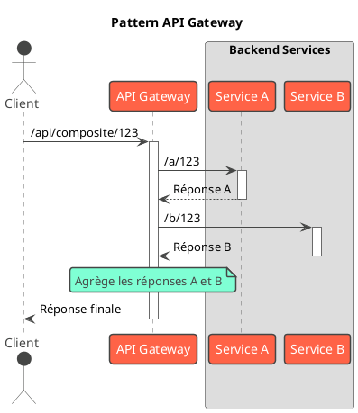

# Hors-Série : Les Grands Patterns d'Architecture

## Objectifs Pédagogiques

À la fin de ce module, vous serez en mesure de :

* **Différencier** un pattern de conception (Design Pattern) d'un pattern d'architecture (Architectural Pattern).
* **Décrire** l'architecture **Monolithique** avec ses avantages et ses inconvénients.
* **Expliquer** le concept de l'architecture **Microservices** et ses principaux défis.
* **Identifier** des patterns clés de l'écosystème microservices, comme **API Gateway** et **Service Discovery**.
* **Comprendre** les principes de l'**Architecture Orientée Événements (EDA)**.
* **Prendre des décisions éclairées** sur le choix d'une architecture en fonction du contexte d'un projet.

## Introduction : Du Plan de la Maison au Plan de la Ville

Jusqu'à présent, nous avons travaillé sur le plan de notre maison. Nous avons appris à concevoir les pièces (patterns de
création), à les assembler (patterns de structure) et à définir comment on y vit (patterns comportementaux).

Les patterns d'architecture, c'est le **plan d'urbanisme**. On ne réfléchit plus à une seule maison, mais à la manière
dont des dizaines ou des centaines de maisons (services, applications) vont interagir pour former une ville
fonctionnelle. On s'intéresse aux routes (réseaux), à la distribution d'électricité (communication), et aux services
publics (infrastructures partagées).

En tant que Concepteur Développeur d'Application, comprendre ces patterns est ce qui vous permettra de participer aux
décisions techniques les plus impactantes d'un projet.

## L'essentiel : Monolithe vs. Microservices

Ce sont les deux grands styles architecturaux que vous rencontrerez le plus souvent.

### L'Architecture Monolithique

C'est l'approche traditionnelle et le point de départ de la plupart des applications, y compris notre projet fil rouge
de bibliothèque.

* **Définition :** L'application entière est construite et déployée comme une **unité unique**. Le front-end, le
  back-end, la logique métier, la couche d'accès aux données... tout est dans le même processus, la même base de code,
  et souvent le même fichier déployable (un `.jar` ou un `.war`).
* **Analogie :** Un grand bâtiment de bureaux où tous les départements (Ventes, Marketing, RH) travaillent sous le même
  toit.

#### Structure

<code-block lang="plantuml">
@startuml
!theme vibrant
title "Architecture Monolithique"

actor User

node "Application 'Bibliothèque' (un seul .jar)" {
rectangle "Interface Utilisateur (API REST)" as UI
rectangle "Couche Métier" as Business {
component "Service Livres"
component "Service Utilisateurs"
component "Service Emprunts"
}
rectangle "Couche d'Accès aux Données (DAO/Repositories)" as DAL

    UI --> Business
    Business --> DAL

}

database "Base de Données Unique" as DB

DAL --> DB

User -> UI
@enduml
</code-block>

<tabs>
<tab title="Avantages ✅">
<ul>
    <li><b>Simplicité de développement :</b> Tout est dans le même projet. Pas de complexité réseau à gérer pour la communication interne.</li>
    <li><b>Simplicité de déploiement :</b> On déploie un seul fichier.</li>
    <li><b>Performance :</b> Les appels entre services sont de simples appels de méthode en mémoire, ce qui est extrêmement rapide.</li>
    <li><b>Facilité de test :</b> Les tests de bout en bout (end-to-end) sont plus simples à mettre en place.</li>
</ul>
</tab>
<tab title="Inconvénients ❌">
<ul>
    <li><b>Scalabilité difficile :</b> Si seule la partie "Recherche de livre" est surchargée, vous devez scaler toute l'application, ce qui est coûteux et inefficace.</li>
    <li><b>Fragilité (couplage fort) :</b> Un bug dans un module peut faire tomber toute l'application. Une modification peut avoir des effets de bord imprévisibles.</li>
    <li><b>Barrière technologique :</b> L'ensemble de l'application est "coincé" dans une seule pile technologique. Mettre à jour une librairie ou changer de version de langage est une opération lourde et risquée.</li>
    <li><b>Complexité croissante :</b> Avec le temps, le monolithe peut devenir une "Big Ball of Mud" (grosse boule de boue), difficile à comprendre et à maintenir.</li>
</ul>
</tab>
</tabs>

### L'Architecture Microservices

C'est une approche qui vise à résoudre les problèmes du monolithe en décomposant l'application en un ensemble de petits
services indépendants.

* **Définition :** L'application est une suite de **petits services autonomes**, chacun s'exécutant dans son propre
  processus et communiquant via des mécanismes légers, souvent une API HTTP/REST. Chaque service est organisé autour
  d'une capacité métier.
* **Analogie :** Un campus d'affaires où chaque département a son propre bâtiment, avec ses propres règles et sa propre
  sécurité. Ils communiquent par téléphone ou par courrier (réseau).

#### Structure {id="structure_1"}

<code-block lang="plantuml">
@startuml
!theme vibrant
title "Architecture Microservices"

actor User

package "Services Déployés Indépendamment" {
node "Service Catalogue (catalogue.jar)" {
database "DB Livres" as DB_Book
}
node "Service Utilisateurs (user.jar)" {
database "DB Users" as DB_User
}
node "Service Emprunts (loan.jar)" {
database "DB Emprunts" as DB_Loan
}
}

User --> "Service Catalogue"
User --> "Service Utilisateurs"

"Service Emprunts" --> "Service Catalogue" : Appel API
"Service Emprunts" --> "Service Utilisateurs" : Appel API

note bottom: Chaque service a sa propre base de données !
@enduml
</code-block>

<tabs>
<tab title="Avantages ✅">
<ul>
    <li><b>Scalabilité ciblée :</b> On peut scaler indépendamment chaque service en fonction de sa charge.</li>
    <li><b>Résilience :</b> La panne d'un service non critique n'entraîne pas forcément la panne de tout le système.</li>
    <li><b>Flexibilité technologique :</b> Chaque service peut être écrit avec la technologie la plus adaptée. Un service en Java, un autre en Python, un troisième en Go.</li>
    <li><b>Déploiement indépendant et rapide :</b> On peut mettre à jour un seul service sans redéployer tout le reste.</li>
    <li><b>Autonomie des équipes :</b> Chaque équipe peut être propriétaire d'un ou plusieurs services, ce qui favorise la vélocité.</li>
</ul>
</tab>
<tab title="Inconvénients ❌">
<ul>
    <li><b>Complexité opérationnelle :</b> Gérer le déploiement, la surveillance, et le logging de dizaines de services est un défi majeur (nécessite des outils comme Docker, Kubernetes, etc.).</li>
    <li><b>Complexité de la communication :</b> Les appels réseau sont plus lents et moins fiables que les appels en mémoire. Il faut gérer les pannes réseau, la latence...</li>
    <li><b>Gestion des données distribuées :</b> C'est le plus grand défi. Comment assurer la cohérence des données ? Comment faire une transaction qui touche plusieurs services ?</li>
    <li><b>Tests distribués :</b> Tester une fonctionnalité qui traverse plusieurs services est très complexe.</li>
</ul>
</tab>
</tabs>

## Pour aller plus loin : Patterns de l'Écosystème Microservices

Adopter une architecture microservices vous oblige à résoudre de nouveaux problèmes. Voici deux patterns
incontournables.

### Le Pattern API Gateway

* **Problème :** Comment les clients (ex: une application mobile) communiquent-ils avec tous ces services ? Doivent-ils
  connaître l'adresse de chaque service ? Que faire pour l'authentification ?
* **Solution :** Mettre en place un point d'entrée unique, une **Facade** pour tout le système.
* **Rôles :**
    1. **Reverse Proxy / Routage :** Le client appelle `https://api.macompagnie.com/books/123` et la gateway sait
       qu'elle doit router cet appel vers le `Service Catalogue`.
    2. **Agrégation :** Pour une page, le client a besoin d'infos sur un livre et son auteur. Au lieu de faire deux
       appels, le client fait un seul appel à la gateway, qui se charge d'appeler le `Service Catalogue` et le
       `Service Utilisateurs` et de fusionner les réponses.
    3. **Responsabilités transversales :** La gateway peut gérer l'authentification, la journalisation (logging), la
       limitation de débit (rate limiting), le cache, etc., de manière centralisée.

### Le Pattern Service Discovery

* **Problème :** Dans un environnement cloud, les instances de service peuvent démarrer et s'arrêter dynamiquement.
  Leurs adresses IP changent constamment. Comment le `Service Emprunts` peut-il trouver l'adresse actuelle du
  `Service Catalogue` ?
* **Solution :** Utiliser un **annuaire central**, appelé le registre de services (Service Registry).
* **Fonctionnement :**
    1. **Enregistrement (Registration) :** Quand une instance d'un service démarre, elle s'enregistre auprès du registre
       en donnant son nom et son adresse (`Service Catalogue`, `10.20.30.40:8080`).
    2. **Découverte (Discovery) :** Quand le `Service Emprunts` veut appeler le `Service Catalogue`, il demande au
       registre : "Donne-moi l'adresse d'une instance saine de `Service Catalogue`".
    3. **Bilan de santé (Health Check) :** Le registre ou les services eux-mêmes vérifient régulièrement que les
       instances sont toujours en vie. Celles qui ne répondent plus sont retirées de l'annuaire.

**Exemples d'outils :** Netflix Eureka, Consul, et les mécanismes intégrés dans des orchestrateurs comme Kubernetes.

## Une Alternative : L'Architecture Orientée Événements (EDA)

Les architectures Monolithique et Microservices sont principalement basées sur un modèle de communication **synchrone
** (requête/réponse). L'EDA propose un modèle **asynchrone**.

* **Définition :** Les composants du système communiquent en produisant et en consommant des **événements**. Ils ne
  s'appellent pas directement.
* **Analogie :** Une station de radio. Le producteur (`Producer`) émet un message sur une fréquence. Il ne sait pas qui
  écoute. Les auditeurs (`Consumers`) qui sont branchés sur la bonne fréquence reçoivent le message et réagissent.
* **Composants clés :**
    * **Producteur :** Le composant qui émet un événement (ex: `CommandePassée`).
    * **Consommateur :** Le composant qui s'abonne à un type d'événement et réagit.
    * **Broker d'événements (ou Message Bus) :** L'infrastructure centrale (ex: **RabbitMQ, Apache Kafka**) qui reçoit
      les événements et les distribue aux consommateurs intéressés.

<code-block lang="plantuml">
@startuml
!theme vibrant
title "Architecture Orientée Événements (EDA)"

participant Producer as "Service Commandes"
queue Broker as "Event Broker (Kafka)"
participant Consumer1 as "Service Paiements"
participant Consumer2 as "Service Notifications"

Producer -> Broker : Événement: "CommandePassée"
activate Producer
deactivate Producer

Broker -> Consumer1 : "CommandePassée"
activate Consumer1
Broker -> Consumer2 : "CommandePassée"
activate Consumer2

Consumer1 -> Consumer1 : Traite le paiement
deactivate Consumer1

Consumer2 -> Consumer2 : Envoie un email de confirmation
deactivate Consumer2
@enduml
</code-block>

* **Avantages :** **Découplage extrême**. Le service de commandes n'a aucune idée de l'existence des services de
  paiement ou de notification. On peut ajouter de nouveaux consommateurs sans jamais modifier le producteur. Grande *
  *résilience** et **scalabilité**.
* **Inconvénients :** Le flux de travail n'est pas explicite, ce qui peut rendre le système difficile à débugger. La
  gestion de la **cohérence éventuelle** (eventual consistency) est un défi (les données ne sont pas à jour partout
  instantanément).

### Exercice 13 : Scénario d'Évolution d'Architecture

Notre application de bibliothèque, actuellement monolithique, a un succès fulgurant. La direction veut ajouter de
nombreuses fonctionnalités et s'étendre à l'international. L'architecture monolithique commence à montrer ses limites.

**Votre mission (exercice de réflexion) :**

1. Proposez une décomposition de notre monolithe en au moins 3 microservices. Donnez un nom et une responsabilité
   principale à chacun.
2. Prenez une fonctionnalité simple comme "un utilisateur emprunte un livre". Décrivez les interactions (appels API) qui
   auraient lieu entre vos microservices pour accomplir cette tâche.
3. Identifiez au moins deux nouveaux défis majeurs que cette nouvelle architecture introduit par rapport au monolithe.

### Correction exercice 13 {collapsible='true''}

C'est un excellent exercice pour se projeter dans le rôle d'un architecte logiciel.

1. **Décomposition en Microservices :**
    * **`Book-Catalog-Service` :** Responsable de tout ce qui concerne les livres, les auteurs, les catégories. Fournit
      une API pour rechercher des livres, obtenir des détails, gérer l'inventaire.
    * **`User-Management-Service` :** Gère les profils des utilisateurs, l'authentification, les autorisations, les
      coordonnées.
    * **`Loan-Service` :** Orchestre la logique d'emprunt. Il gère l'historique des emprunts, les dates de retour, le
      calcul des pénalités. C'est un service principalement métier.

2. **Interactions pour "emprunter un livre" :**
    * **Étape 1 :** Le client (ex: une borne dans la bibliothèque) envoie une requête `POST /api/loans` au
      `Loan-Service`, en fournissant `userId` et `bookId`.
    * **Étape 2 :** Le `Loan-Service` reçoit la requête. Pour la valider, il doit vérifier que l'utilisateur et le livre
      existent et sont valides.
    * **Étape 3 :** Le `Loan-Service` fait un appel API `GET` au `User-Management-Service` (
      `/api/users/{userId}/status`) pour vérifier que l'utilisateur a le droit d'emprunter.
    * **Étape 4 :** Le `Loan-Service` fait un appel API `GET` au `Book-Catalog-Service` (`/api/books/{bookId}/stock`)
      pour vérifier que le livre est disponible.
    * **Étape 5 :** Si tout est OK, le `Loan-Service` enregistre l'emprunt dans sa propre base de données.
    * **Étape 6 :** Le `Loan-Service` fait un appel API `POST` (ou `PUT`) au `Book-Catalog-Service` (
      `/api/books/{bookId}/decrease-stock`) pour décrémenter le stock.
    * **Étape 7 :** Le `Loan-Service` renvoie une réponse de succès au client.

3. **Nouveaux Défis Majeurs :**
    * **Transactions distribuées :** Que se passe-t-il si l'étape 5 (sauvegarder l'emprunt) réussit, mais que l'étape
      6 (décrémenter le stock) échoue à cause d'une panne réseau ? On se retrouve avec des données incohérentes. La
      gestion des transactions sur plusieurs services est un problème complexe (le pattern **Saga** est une solution).
    * **Latence réseau et fiabilité :** Notre fonctionnalité, qui était une série d'appels de méthode instantanés dans
      le monolithe, est maintenant une chaîne d'appels réseau, chacun ajoutant de la latence et un risque de panne. Il
      faut mettre en place des stratégies de re-tentative (retry) et des disjoncteurs (circuit breakers).

## Auto-évaluation

Testez votre compréhension de ces concepts de haut niveau.

**Questions à Choix Multiple (QCM)**

1. La principale différence entre un pattern de conception et un pattern d'architecture est :
    * a) Les patterns d'architecture ne s'appliquent qu'au cloud.
    * b) Les patterns de conception concernent la structure interne d'un composant, tandis que les patterns
      d'architecture concernent l'organisation globale du système.
    * c) Il n'y a pas de différence.
    * d) Les patterns d'architecture sont plus anciens que les patterns de conception.

2. Quel est le principal avantage d'une architecture monolithique ?
    * a) Scalabilité infinie.
    * b) Simplicité de développement et de déploiement au début du projet.
    * c) Flexibilité technologique.
    * d) Résilience aux pannes.

3. Dans une architecture microservices, le pattern API Gateway sert principalement de...
    * a) Base de données centrale.
    * b) Annuaire pour trouver d'autres services.
    * c) Façade pour le système, simplifiant l'accès pour les clients.
    * d) Broker d'événements.

4. L'architecture orientée événements (EDA) est caractérisée par une communication...
    * a) Synchrone et fortement couplée.
    * b) Asynchrone et faiblement couplée.
    * c) Uniquement via des bases de données partagées.
    * d) Qui ne fonctionne que pour les applications temps réel.

**Questions Ouvertes**

5. Expliquez pourquoi la gestion des données est souvent considérée comme le défi le plus difficile dans une
   architecture microservices.
6. Donnez un exemple concret d'un événement qui pourrait être émis dans notre application de bibliothèque, et nommez
   deux consommateurs potentiels qui pourraient être intéressés par cet événement.

## Conclusion

Ce dernier module vous a donné une vue à 30 000 pieds de la conception logicielle. Vous comprenez maintenant que le
choix d'une architecture est une décision fondamentale qui repose sur un arbitrage complexe entre simplicité,
scalabilité, résilience et coût.

Il n'y a pas de "meilleure" architecture. Le monolithe est parfait pour démarrer, les microservices sont puissants pour
gérer la complexité à grande échelle, et l'EDA offre une flexibilité incroyable pour les systèmes réactifs.

En tant que concepteur, votre rôle est d'analyser le contexte de votre projet – la taille de l'équipe, les compétences,
les objectifs métier, les contraintes de temps et de budget – et de participer au choix du plan d'urbanisme le plus
adapté. Cette compétence, combinée à votre maîtrise des patterns de plus bas niveau, fera de vous un développeur et un
architecte logiciel complet et précieux.

### Corrections de l'auto-évaluation (Architecture)

1. b)
2. b)
3. c)
4. b)
5. **Défi de la gestion des données :** Dans un monolithe, toutes les données sont dans une seule base, garantissant la
   cohérence via des transactions ACID. Dans les microservices, chaque service possède ses propres données. Cela pose
   deux problèmes majeurs : **1. Joindre des données :** pour obtenir des informations qui se trouvent dans deux
   services différents, on doit faire des appels réseau, ce qui est complexe et lent. **2. Maintenir la cohérence :**
   une opération métier qui doit modifier des données dans plusieurs services ne peut pas utiliser une transaction BDD
   classique. Il faut utiliser des mécanismes complexes comme le pattern Saga pour assurer une cohérence "éventuelle",
   ce qui est plus difficile à raisonner.
6. **Exemple d'événement :**
    * **Événement :** `UserRegisteredEvent` (un nouvel utilisateur s'est inscrit).
    * **Consommateur 1 :** Un `WelcomeEmailService` qui s'abonne à cet événement pour envoyer un email de bienvenue au
      nouvel utilisateur.
    * **Consommateur 2 :** Un `AnalyticsService` qui s'abonne à cet événement pour mettre à jour le tableau de bord du
      nombre total d'inscriptions.
      Le service qui a géré l'inscription (ex: `User-Management-Service`) n'a pas besoin de savoir que ces autres
      services existent, il se contente de publier l'événement.