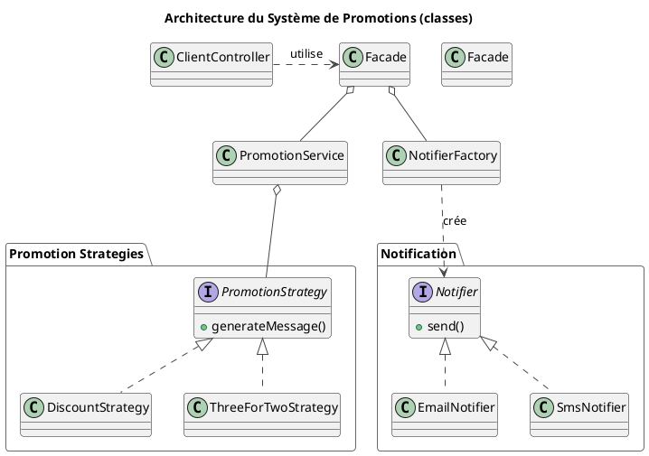
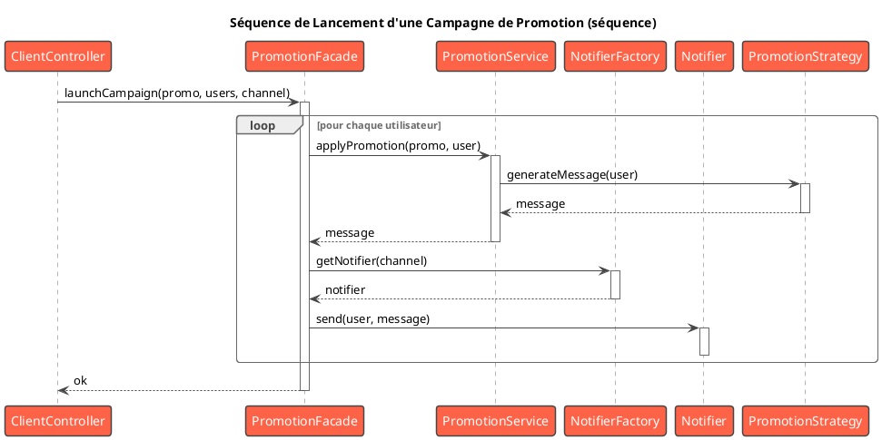

# Atelier Final : Conception d'une Feature de A à Z

## Objectifs Pédagogiques

À la fin de cet atelier, vous aurez démontré votre capacité à :

* **Analyser** une exigence métier et la décomposer en responsabilités techniques.
* **Sélectionner** une combinaison de Design Patterns appropriés pour résoudre un problème complexe.
* **Justifier** vos choix de conception de manière argumentée.
* **Concevoir** une solution flexible, maintenable et extensible.
* **Implémenter** cette solution en intégrant harmonieusement plusieurs patterns.

## Introduction : Votre Chef-d'Œuvre

Vous avez suivi la formation, vous avez appris les gammes, vous avez maîtrisé vos outils. Cet atelier est votre concert.
Il ne s'agit plus de reproduire un exercice sur un seul pattern, mais de faire face à une page blanche (ou presque) et
de composer votre propre solution.

C'est l'exercice qui incarne le mieux votre futur rôle de **Concepteur Développeur d'Application**. Il met l'accent sur
la phase la plus cruciale et la plus créative du développement : la **conception**. Comment allez-vous structurer votre
code pour qu'il réponde au besoin d'aujourd'hui, tout en étant prêt pour les demandes de demain ?

## Le Scénario : Le Nouveau Système de Promotions

La direction de la bibliothèque est ravie de votre travail et souhaite maintenant lancer un programme de fidélisation
pour dynamiser les emprunts.

**L'exigence métier est la suivante :**
> "Nous voulons pouvoir lancer des campagnes promotionnelles ciblées pour nos utilisateurs. Une campagne doit permettre
> d'envoyer une offre par email ou SMS à un groupe d'utilisateurs. Les offres peuvent être de différents types : par
> exemple, '10% de réduction sur les pénalités de retard' ou 'Empruntez 2 livres, le 3ème est gratuit pour une semaine'.
> Le système doit être flexible pour nous permettre d'ajouter facilement de nouveaux types d'offres à l'avenir."

## Votre Mission : De l'Idée au Code

Cet atelier se déroule en deux temps : d'abord la conception, ensuite l'implémentation.

### Partie 1 : La Phase de Conception (Réflexion)

Avant d'écrire la moindre ligne de code, prenez une feuille de papier (ou un outil de diagrammes) et répondez aux
questions suivantes. C'est la phase la plus importante.

1. **Identification des responsabilités :** Quelles sont les grandes "idées" ou "responsabilités" dans ce système ? (ex:
   la promotion elle-même, la manière d'appliquer la promotion, l'envoi de la notification, etc.).
2. **Choix des Patterns :** Pour chaque responsabilité identifiée, quel(s) pattern(s) vous semble(nt) le(s) plus
   approprié(s) ?
    * Comment représenter une promotion, qui peut avoir de nombreux paramètres (date de début, date de fin, description,
      type...) ?
    * Comment gérer les différents types d'offres (`10% de réduction`, `3 pour 2`) de manière à pouvoir en ajouter
      facilement de nouvelles ?
    * Comment gérer les différents canaux de notification (email, SMS) ? (Nous avons déjà des pistes !)
    * Comment simplifier le déclenchement d'une campagne pour le code client (par exemple, un administrateur qui clique
      sur un bouton "Lancer la campagne") ?
3. **Justification :** Pour chaque pattern choisi, écrivez une phrase expliquant **pourquoi** vous l'avez sélectionné.
4. **Diagramme d'ensemble :** Esquissez un diagramme UML (même simplifié) montrant comment ces différents composants et
   patterns interagissent entre eux.

<warning>
Ne sautez pas cette étape ! C'est le cœur de l'exercice. Prenez 15 à 30 minutes pour y réfléchir sérieusement avant de consulter la correction.
</warning>

### Partie 2 : La Phase d'Implémentation (Action)

Une fois votre conception au clair, il est temps de la traduire en code dans notre projet fil rouge.

**Cahier des charges :**

1. **Le Modèle :** Créez une classe `Promotion` qui représente une offre. Utilisez le pattern que vous avez choisi pour
   sa construction.
2. **Les Algorithmes :** Implémentez la logique pour les différents types d'offres (`DiscountPromotionStrategy`,
   `ThreeForTwoPromotionStrategy`) en utilisant le pattern approprié. Ces "stratégies" prendront un utilisateur en
   paramètre et retourneront un message décrivant l'offre personnalisée.
3. **L'Orchestration :** Créez un service (`PromotionService`) capable d'appliquer une promotion à un utilisateur. Ce
   service utilisera les algorithmes de l'étape 2.
4. **La Simplification :** Créez une classe qui simplifie tout le processus (`PromotionFacade`). Elle prendra en entrée
   une `Promotion`, une liste d'utilisateurs cibles et un canal de notification. Elle se chargera d'orchestrer le
   `PromotionService` et le `NotificationService`.
5. **Le Point d'Entrée :** Créez un `PromotionController` avec un endpoint `POST /api/promotions/launch` qui déclenche
   l'envoi d'une campagne via la façade.

---

### Correction de l'Atelier {collapsible="true"}

Excellent travail ! Comparons maintenant votre conception et votre implémentation avec une solution possible. Il n'y a
pas une seule bonne réponse, mais les principes directeurs devraient être similaires.

#### Correction Partie 1 : Conception

1. **Responsabilités identifiées :**
    * Représenter l'objet `Promotion` avec ses multiples attributs.
    * Définir la logique d'application de l'offre (le "calcul" de la promotion).
    * Notifier l'utilisateur via différents canaux.
    * Fournir un point d'entrée simple pour lancer une campagne.

2. **Choix des Patterns :**
    * **Builder :** Pour construire l'objet `Promotion`. Une promotion a des attributs obligatoires (titre) et de
      nombreux attributs optionnels (dates, description, type...). Le Builder est parfait pour gérer cette complexité et
      assurer la création d'un objet valide.
    * **Strategy :** Pour gérer les différents types d'offres. Chaque type d'offre est un "algorithme" différent pour
      générer le message de promotion. Ce pattern nous garantit de pouvoir ajouter de nouveaux types d'offres sans
      modifier le code existant (**OCP**).
    * **Factory Method (implicite) :** Pour choisir le bon canal de notification. Nous réutiliserons notre
      `NotifierFactory` pour obtenir le `Notifier` (Email, SMS) approprié.
    * **Facade :** Pour cacher la complexité de l'orchestration. Le client (le contrôleur) n'a pas besoin de savoir qu'
      il faut un `PromotionService` ET un `NotificationService`. Il appellera une seule méthode sur la
      `PromotionFacade`, qui se chargera de coordonner tout le monde.

3. **Diagramme d'ensemble :**








#### Correction Partie 2 : Implémentation

##### 1. Le Modèle `Promotion` avec son Builder

Dans un nouveau package `fr.formation.spring.app.promotion.model` :

```java
package fr.formation.spring.app.promotion.model;

import java.time.LocalDate;

public class Promotion {
    private final String title;
    private final String description;
    private final String type; // ex: "DISCOUNT", "3FOR2"
    private final LocalDate startDate;
    private final LocalDate endDate;

    // Constructeur privé, accessible uniquement par le Builder
    private Promotion(Builder builder) {
        this.title = builder.title;
        this.description = builder.description;
        this.type = builder.type;
        this.startDate = builder.startDate;
        this.endDate = builder.endDate;
    }

    // Getters publics...
    public String getTitle() {
        return title;
    }

    public String getType() {
        return type;
    }
    // ...

    // Classe Builder interne statique
    public static class Builder {
        // Attributs obligatoires
        private final String title;
        private final String type;

        // Attributs optionnels
        private String description = "";
        private LocalDate startDate = LocalDate.now();
        private LocalDate endDate = LocalDate.now().plusMonths(1);

        public Builder(String title, String type) {
            this.title = title;
            this.type = type;
        }

        public Builder withDescription(String description) {
            this.description = description;
            return this;
        }

        public Builder validFrom(LocalDate startDate) {
            this.startDate = startDate;
            return this;
        }

        public Builder validUntil(LocalDate endDate) {
            this.endDate = endDate;
            return this;
        }

        public Promotion build() {
            // On pourrait ajouter des validations ici
            return new Promotion(this);
        }
    }
}
```

##### 2. Les Stratégies de Promotion

Dans `fr.formation.spring.app.promotion.strategy` :

```java
// PromotionStrategy.java
package fr.formation.spring.app.promotion.strategy;

import fr.formation.spring.app.observer.User; // On réutilise notre User

public interface PromotionStrategy {
    String generateMessage(User user);
}

// DiscountPromotionStrategy.java
package fr.formation.spring.app.promotion.strategy;

// ...
public class DiscountPromotionStrategy implements PromotionStrategy {
    @Override
    public String generateMessage(User user) {
        return "Offre spéciale pour vous, " + user.getName()
                + "! Bénéficiez de 10% de réduction sur vos prochaines pénalités.";
    }
}

// ThreeForTwoPromotionStrategy.java
package fr.formation.spring.app.promotion.strategy;

// ...
public class ThreeForTwoPromotionStrategy implements PromotionStrategy {
    @Override
    public String generateMessage(User user) {
        return "Bonjour " + user.getName()
                + "! Profitez de notre offre '3 pour 2' sur une sélection de livres ce mois-ci.";
    }
}
```

##### 3 & 4. Le `PromotionService` et la `PromotionFacade`

Dans `fr.formation.spring.app.promotion.service` :

```java
// PromotionService.java (le Contexte)
package fr.formation.spring.app.promotion.service;
// ...

import java.util.Map;

// Ce service sera un bean Spring
@Service
public class PromotionService {
    private final Map<String, PromotionStrategy> strategies;

    // Spring injecte toutes les stratégies dans une Map
    public PromotionService(Map<String, PromotionStrategy> strategies) {
        this.strategies = strategies;
    }

    public String applyPromotion(Promotion promo, User user) {
        // On récupère la bonne stratégie en fonction du type de la promotion
        PromotionStrategy strategy = strategies.get(promo.getType());
        if (strategy == null) {
            throw new IllegalArgumentException("Type de promotion inconnu: " + promo.getType());
        }
        return strategy.generateMessage(user);
    }
}

// Il faut déclarer nos stratégies comme des beans
// @Component("DISCOUNT") public class DiscountPromotionStrategy ...
// @Component("3FOR2") public class ThreeForTwoPromotionStrategy ...
```

```java
// PromotionFacade.java
package fr.formation.spring.app.promotion.service;

// ...
@Service
public class PromotionFacade {
    private final PromotionService promotionService;
    // On suppose que NotifierFactory est accessible
    private final NotifierFactory notifierFactory = new NotifierFactory();

    public PromotionFacade(PromotionService promotionService) {
        this.promotionService = promotionService;
    }

    public void launchCampaign(Promotion promo, List<User> users, String channel) {
        System.out.println("Lancement de la campagne : " + promo.getTitle());
        Notifier notifier = notifierFactory.getNotifier(channel);

        for (User user : users) {
            String message = promotionService.applyPromotion(promo, user);
            notifier.send(user.getName(), message); // On envoie au nom de l'utilisateur
        }
    }
}
```

##### 5. Le `PromotionController` et le test

```java
// Dans un nouveau PromotionController.java
// ...
@RestController
@RequestMapping("/api/promotions")
public class PromotionController {
    private final PromotionFacade promotionFacade;

    public PromotionController(PromotionFacade facade) {
        this.promotionFacade = facade;
    }

    // Pour simplifier, on hardcode la campagne dans le contrôleur.
    // Dans une vraie app, on la recevrait en paramètre (DTO).
    @PostMapping("/launch")
    public ResponseEntity<String> launchTestCampaign() {
        // 1. Construire la promotion avec le Builder
        Promotion discountPromo = new Promotion.Builder("Offre de Noël", "DISCOUNT")
                .withDescription("Une super offre pour les fêtes")
                .build();

        // 2. Créer une liste d'utilisateurs cibles
        List<User> targetUsers = List.of(
                new User("Paul Atréides"),
                new User("Dame Jessica")
        );

        // 3. Appeler la Facade pour lancer la campagne par Email
        promotionFacade.launchCampaign(discountPromo, targetUsers, "EMAIL");

        return ResponseEntity.ok("Campagne '" + discountPromo.getTitle() + "' lancée !");
    }
}
```

**Requête de test :**

```http
### Lancer une campagne de promotion
POST http://localhost:8080/api/promotions/launch
```

**Sortie attendue dans la console :**

```
Lancement de la campagne : Offre de Noël
--- ENVOI EMAIL ---
À: Paul Atréides@email.com
Message: Offre spéciale pour vous, Paul Atréides! Bénéficiez de 10% de réduction sur vos prochaines pénalités.
--------------------
--- ENVOI EMAIL ---
À: Dame Jessica@email.com
Message: Offre spéciale pour vous, Dame Jessica! Bénéficiez de 10% de réduction sur vos prochaines pénalités.
--------------------
```

Cet atelier montre comment plusieurs patterns (Builder, Strategy, Facade, Factory) collaborent pour créer une solution
robuste, flexible et élégante. Chaque pattern résout une partie spécifique du problème, et ensemble, ils forment une
architecture solide. C'est ça, la conception logicielle.